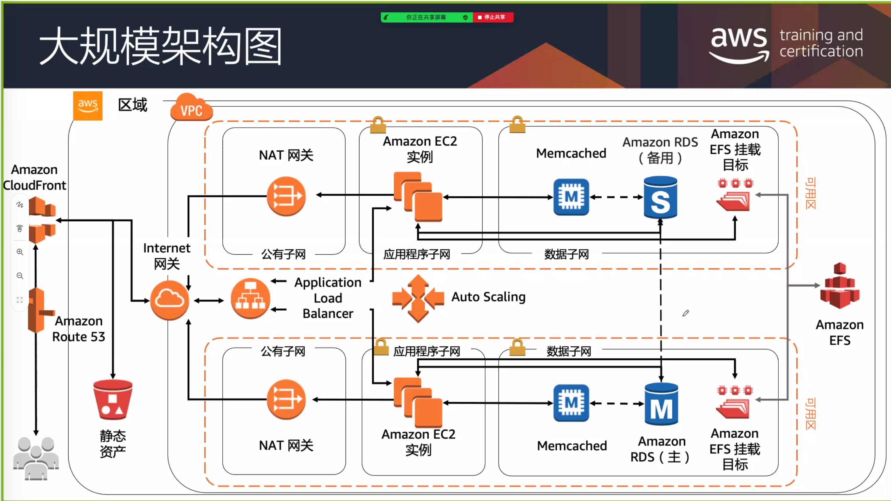

# Course description

Architecting on AWS is for solutions architects, solution-design engineers, and developers seeking an understanding of AWS architecting. In this course, you will learn to identify services and features to build resilient, secure and highly available IT solutions on the AWS Cloud.
Architectural solutions differ depending on industry, types of applications, and business size. AWS Authorized Instructors emphasize best practices using the AWS Well-Architected Framework, and guide you through the process of designing optimal IT solutions, based on real-life scenarios. The modules focus on account security, networking, compute, storage, databases, monitoring, automation, containers, serverless architecture, edge services, and backup and recovery. At the end of the course, you will practice building a solution and apply what you have learned with confidence.

   • Course level: Intermediate
   • Duration: 3 days

## Activities

This course includes presentations based on use cases, group discussions, demonstrations, assessments, and hands-on labs.

## Course objectives

   • Identify AWS architecting basic practices.
   • Explore using the AWS management tools: The AWS Console, Command Line Interface (CLI), and CloudFormation in a lab environment.
   • Examine the enforcement of accounts security using policies.
   • Identify the elements that build an elastic, secure, virtual network that includes private and public subnets.
   • Practice building an AWS core networking infrastructure.
   • Determine strategies for a layered security approach to Virtual Private Cloud (VPC) subnets.
   • Identify strategies to select the appropriate compute resources based on business use-cases.
   • Practice building a VPC and adding an Elastic Cloud Compute (EC2) instance in a lab environment.
   • Practice installing an Amazon Relational Database Service (RDS) instance and an Application Load Balancer (ALB) in the VPC you created.
   • Compare and contrast AWS storage products and services, based on business scenarios.
   • Compare and contrast the different types of AWS database services based on business needs.
   • Practice building a highly available, auto-scaling database layer in a lab.
   • Explore the business value of AWS monitoring solutions.
   • Identify the role of monitoring, event driven load balancing, and auto scaling responses, based on usage and needs.
   • Identify and discuss AWS automation tools that will help you build, maintain and evolve your infrastructure.
   • Discuss network peering, VPC endpoints, gateway and routing solutions based on use-cases.
   • Discuss hybrid networking configurations to extend and secure your infrastructure.
   • Discuss the benefits of microservices as an effective decoupling strategy to power highly available applications at scale.
   • Explore AWS container services for the rapid implementation of an infrastructure-agnostic, portable application environment.
   • Identify the business and security benefits of AWS serverless services based on business examples.
   • Practice building a serverless infrastructure in a lab environment.
   • Discuss the ways in which AWS edge services address latency and security.
   • Practice building a CloudFront deployment with an S3 backend in a lab environment.
   • Explore AWS backup, recovery solutions, and best practices to ensure resiliency and business continuity.
   • Build a highly available and secure cloud architecture based on a business problem, in a project-based facilitator-guided lab.

## Intended audience

This course is intended for solutions architects, solution-design engineers, developers seeking an understanding of AWS architecting and individuals seeking the AWS Solutions Architect-Associate certification.

## Prerequisites

We recommend that attendees of this course have the following prerequisites:
   • AWS Cloud Practitioner Essentials, or
    Working knowledge of distributed systems
    Familiarity with general networking concepts
    Familiarity with IP addressing
    Working knowledge of multi-tier architectures
    Familiarity with cloud computing concepts

# Course outline

## Day 1

### Module 0: Introductions & Course Map review

​    • Welcome and course outcomes

### Module 1: Architecting Fundamentals Review

​    • AWS Services and Infrastructure
​    • Infrastructure Models
​    • AWS API Tools
​    • Securing your infrastructure
​    • The Well-Architected Framework
​    • Hands-on lab: Explore Using the AWS API Tools to Deploy an EC2 Instance

### Module 2: Account Security

​    • Security Principals
​    • Identity and Resource-Based Policies
​    • Account Federation
​    • Introduction to Managing Multiple Accounts

PEARC:

- Person
- Effect: Allow or Deny
- Action
- Resources
- Conditions

S3 全部都是Inline Policy

权限的边界就是账户

### Module 3: Networking, Part 1

​    • IP Addressing
​    • Amazon Virtual Private Cloud (VPC), Patterns and Quotas
​    • Routing
​    • Internet Access
​    • Network Access Control Lists (NACLs)
​    • Security Groups

### Module 4: Compute

- 用户数据（User Data）
- 元数据（Metadata）

​    • Amazon Elastic Cloud Compute (EC2)
​    • EC2 Instances and Instance Selection
​    • High Performance Computing on AWS
​    • Lambda and EC2, When to Use Which
​    • Hands-On Lab: Build Your Amazon VPC Infrastructure

## Day 2

### Module 5: Storage

​    • Shared File Systems
​    • Shared EBS Volumes
​    • Amazon S3, Security, Versioning and Storage Classes
​    • Data Migration Tools

### Module 6: Database Services

​    • AWS Database Solutions
​    • Amazon Relational Database Services (RDS)
​    • DynamoDB, Features and Use Cases
​    • Redshift, Features, Use Cases and Comparison with RDS
​    • Scaling
​    • Caching and Migrating Data
​    • Hands-on Lab: Create a Database Layer in Your Amazon VPC Infrastructure

缓存的作用：

- 提高性能
- 节约成本
- 降低一部分安全风险

### Module 7: Monitoring and Scaling

​    • Monitoring: CloudWatch, CloudTrail, and VPC Flow Logs
​    • Invoking Events
​    • Elastic Load Balancing
​    • Auto Scaling Options and Monitoring Cost
​    • Hands-on Lab: Configure High Availability in Your Amazon VPC

### Module 8: Automation

​    • CloudFormation
​    • AWS Systems Manager

### Module 9: Containers

​    • Microservices
​    • Monitoring Microservices with X-Ray
​    • Containers

## Day 3

### Module 10: Networking Part 2

- VPC(Region)
  - Subnet(Available Area)
    - Network Access Interface(Security Group):所有操作都是允许操作

​    • VPC Peering & Endpoints
​    • Transit Gateway
​    • Hybrid Networking
​    • Route 53

网关：

- IGW（互联网网关）
- Nat（Native Access Transform Gateway）
- VGW（Virtual Private Gateway）
- CGW（Custom Private Gateway)
- Peering Gateway
- Transit Gateway
- Gateway Endpoint

### Module 11: Serverless Architecture

​    • Amazon API Gateway
​    • Amazon SQS, Amazon SNS
​    • Amazon Kinesis Data Streams & Kinesis Firehose
​    • Step Functions
​    • Compare Amazon SQS to Amazon MQ
​    • Hands-on Lab: Build a Serverless Architecture

Lambda尽量不要去等（耗时的操作不要做，需要提前准备好），以ms为单位计费，EC2以s为单位计费

### Module 12: Edge Services

​    • Amazon CloudFront
​    • AWS Web Application Firewall (WAF), DDoS and Firewall Manager
​    • Compare AWS Global Accelerator and Amazon CloudFront
​    • AWS Outposts
​    • Hands-On Lab: Configure an Amazon CloudFront Distribution with an
Amazon S3 Origin

### Module 13: Backup and Recovery

​    • Planning for Disaster Recovery
​    • AWS Backup
​    • Recovery Strategies

## Capstone Lab: Build an AWS Multi-Tier Architecture

Participants review the concepts and services learned in class and build a solution based on a scenario. The lab environment provides partial solutions to promote analysis and reflection. Participants deploy a highly available architecture. The instructor is available for consultation.

Use the Online Course Supplement (OCS) to review use cases, investigate data, and answer architecting design questions.