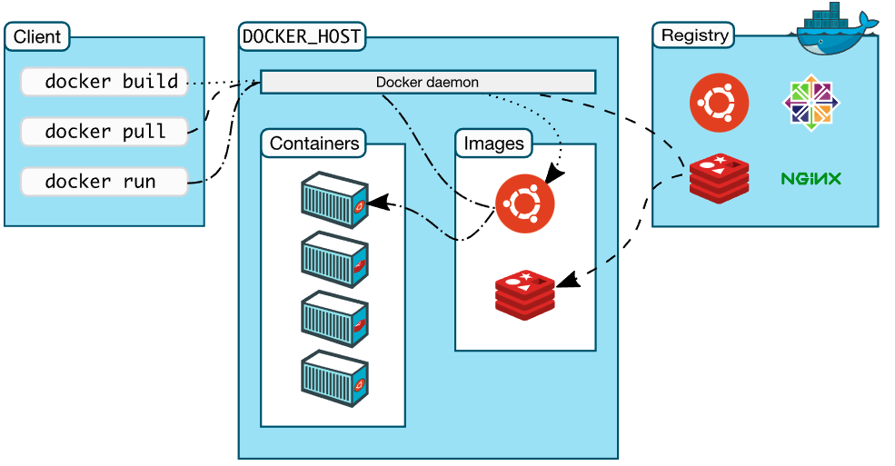
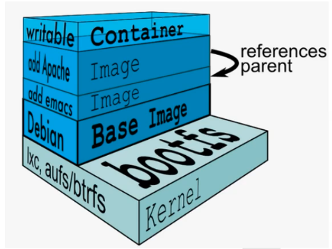
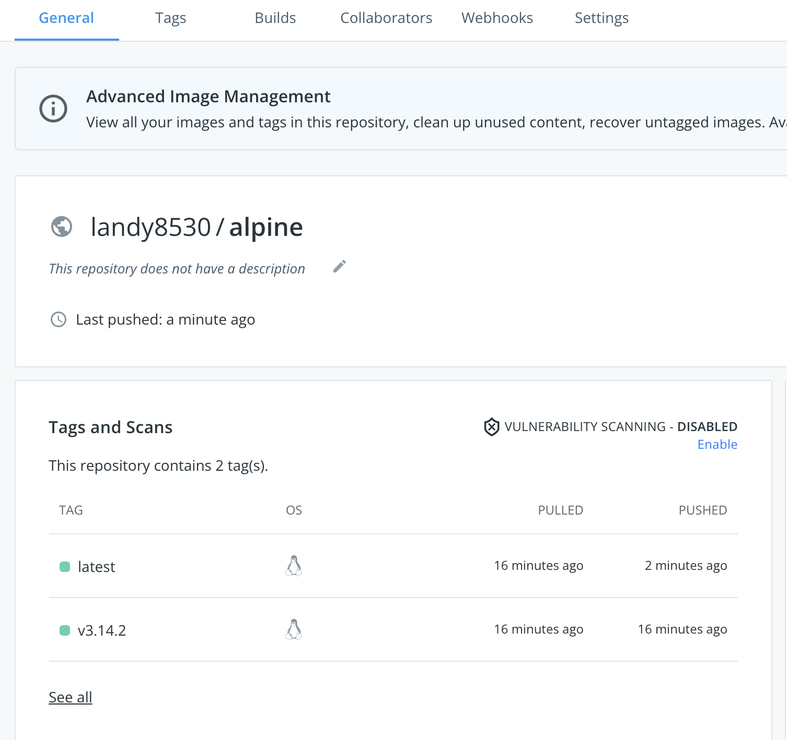
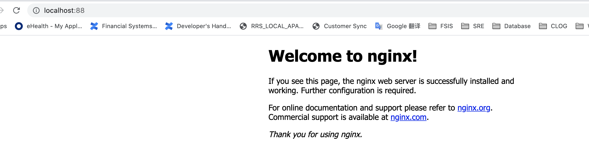
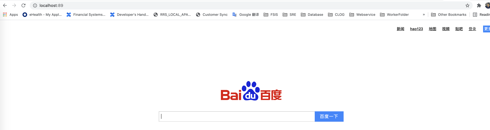
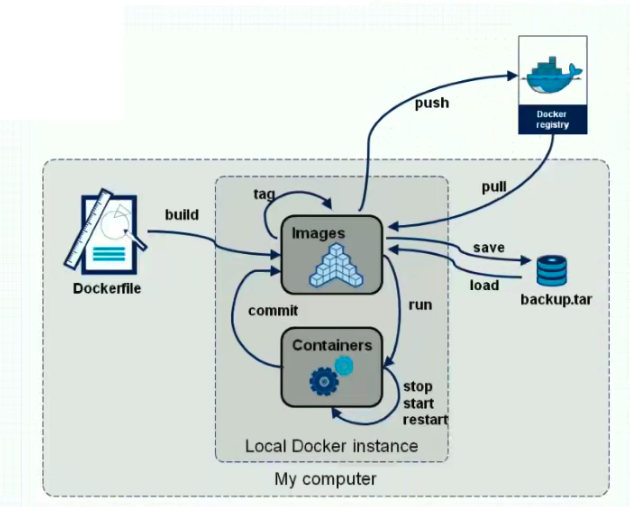
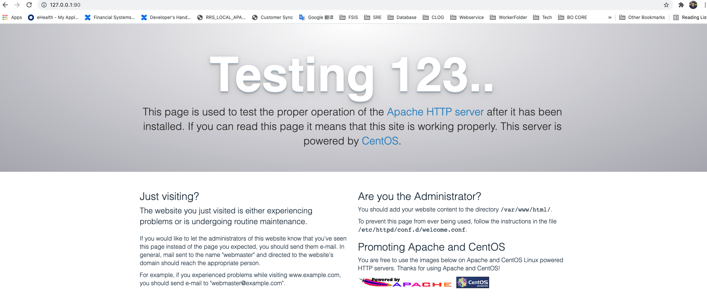

# Docker 技术入门基础

[TOC]


## 1 容器化技术概述

容器，其实是一种特殊的“进程”而已。容器化技术极大地解决了虚拟化技术所造成的开销大的问题。

一个“容器”，实际上是一个由 Linux Namespace、Linux Cgroups 和 rootfs 三种技术构建出来的进程的隔离环境。

1. **Namespace** 的作用是“隔离”，它让应用进程只能看到该 Namespace 内的“世界”；修改进程视图的主要方法
2. **Cgroups** 的作用是“限制”，它给这个“世界”围上了一圈看不见的墙。制造约束的主要手段
3. 一组联合挂载在 /var/lib/docker/aufs/mnt 上的 **rootfs**，这一部分我们称为“容器镜像”（Container Image），是容器的静态视图；一个由 Namespace+Cgroups 构成的隔离环境，这一部分我们称为“容器运行时”（Container Runtime），是容器的动态视图。

### 1.1 Chroot技术

如果需要在一个宿主机上运行多个容器，且容器之间相互个离，那么第一个就需要系统库文件的依赖，对于一个容器而言，需要将其需要的系统文件单独复制出来一份，放到指定目录，并且需要让进程认为这就是根目录，而不是去调用宿主机系统上的库文件。Chroot就是一个切换根目录的方式。

### 1.2 Namespace机制

为了让多个容器以沙盒的方式在宿主机上运行，就需要提前定义好各个容器能看到的边界。由于各个容器都是直接运行在宿主机系统上，因此需要内核对各个容器的上下文进行修改，让他们看上去是一个独立的操作系统。比如，指定PID为1的进程，指定网卡设备，指定文件系统挂载，指定用户等等。

> 在Linux操作系统中，当内核初始化完毕之后，会启动一个init进程，这个进程是整个操作系统的第一个用户进程，所以它的进程ID为1，也就是我们常说的PID1进程。在这之后，所有的用户态进程都是该进程的后代进程，由此我们可以看出，整个系统的用户进程，是一棵由init进程作为根的进程树。
>
> init进程有一个非常厉害的地方，就是SIGKILL信号对它无效。很显然，如果我们将一棵树的树根砍了，那么这棵树就会分解成很多棵子树，这样的最终结果是导致整个操作系统进程杂乱无章，无法管理。

在容器中看到只有自己一个进程，但是这个进程其实是在宿主机上的，只不过是一个独立的namespace。

Linux操作系统内核从底层实现了为各个进程创建独立用户空间的功能，不同用户空间似于一个个独立的虚拟机系统，用户空间内部进程不能感知到其它用户空间中的进程状态。内核提供了六种Namespaces:

| Type  |                          | Description                                                  | 内核版本 |
| ----- | ------------------------ | ------------------------------------------------------------ | -------- |
| UTS   | hostname and domainname  | 主机名和域名隔离，运行内核的名称、版本、底层体系结构类型等信息（UNIX Timesharing System） | 2.6.19   |
| User  |                          | 用户隔离。运行进程的用户和组                                 | 3.8.x    |
| Mount |                          | 挂载点隔离。已经装载的文件系统的视图 Mount Namespace，用于让被隔离进程只看到当前 Namespace 里的挂载点信息，主要指根目录 | 2.4.19   |
| IPC   | Inter-process-connection | 进程间通信隔离。消息队列、共享内容、信号量                   | 2.6.19   |
| PID   | Process                  | 有关进程ID的信息                                             |          |
| ID    | PID隔离                  |                                                              | 2.6.24   |
| Net   | Network                  | 网络隔离：网络相关的命名空间参数 Network Namespace，用于让被隔离进程看到当前 Namespace 里的网络设备和配置（网络设备、协议栈、端口） | 2.6.29   |

在 Linux 内核中，有很多资源和对象是不能被 Namespace 化的，最典型的例子就是：**时间**。

### 1.3 Cgroup技术

Linux Cgroups 就是 Linux 内核中用来为进程设置资源限制的一个重要功能。Linux Cgroups 的全称是 Linux Control Group。它最主要的作用，就是限制一个进程组能够使用的资源上限，包括 CPU、内存、磁盘、网络带宽等等。此外，Cgroups 还能够对进程进行优先级设置、审计，以及将进程挂起和恢复等操作。

一个正在运行的 Docker 容器，其实就是一个启用了多个 Linux Namespace 的应用进程，而这个进程能够使用的资源量，则受 Cgroups 配置的限制。这也是容器技术中一个非常重要的概念，即：容器是一个“单进程”模型。

## 2 Basic Docker Architucture

### 2.1 What's Docker

> Docker is an open platform for developing, shipping, and running applications. Docker enables you to separate your applications from your infrastructure so you can deliver software quickly. With Docker, you can manage your infrastructure in the same ways you manage your applications. By taking advantage of Docker’s methodologies for shipping, testing, and deploying code quickly, you can significantly reduce the delay between writing code and running it in production.

- Docker是基于容器技术的轻量级的虚拟化技术解决方案
- Docker是容器引擎，把Linux的cgroup、namespace等容器底层技术进行封装抽象，并为用户提供了创建和管理容器的便捷界面（包括Command Line和API）
- Docker是一个开源项目，诞生于2013年初，基于Google推出的Go语言实现
- 相比于其他早期的容器技术，Docker引入了一整套的容器干里的生态系统，包括分层的镜像模型，容器注册库，友好的Rest API

#### 2.1.1 Docker容器化的优点

- Docker引擎统一了基础设施环境（Docker环境）
  - 硬件的配置
  - 操作系统的版本
  - 运行时环境的异构
  
- Docker引擎统一了程序打包方式（Docker镜像）
  - Java程序
  - Python程序
  - ...
  
- Docker引擎统一了程序部署方式（Docker容器）
  - Java - jar ... --> docker run ...
  - Python manage.py rumserver ... --> docker run ...
  - ....
  
- Docker解决了资源隔离的问题

  - cpu、memory资源隔离与限制
  - 访问设备隔离与限制

  - 网络隔离与限制
  - 用户、用户组隔离限制

#### 2.1.2 Docker容器化的缺点

- 单机使用，无法有效集群
- 随着容器数量的上升，管理成本攀升
- 没有有效的容灾/自愈机制
- 没有预设编排模版，无法实现快速、大规模容器调度
- 没有统一的配置管理中心工具
- 没有容器生命周期的管理工具
- 没有图形化运维管理工具
- ...

#### 2.1.3 容器的生命周期

- 检查本地是否存在镜像，如果不存在即从远端仓库检索
- 利用镜像启动容器
- 分配一个文件系统，并在只读的镜像层外挂载一个可读写层
- 从宿主机配置的网桥接口中桥接一个虚拟接口到容器
- 从地址池配置一个ip地址给容器
- 执行用户指定的指令
- 执行完毕后容器终止

### 2.2 Docker Architecture



> Docker uses a client-server architecture. The Docker *client* talks to the Docker *daemon*, which does the heavy lifting of building, running, and distributing your Docker containers. The Docker client and daemon *can* run on the same system, or you can connect a Docker client to a remote Docker daemon. The Docker client and daemon communicate using a REST API, over UNIX sockets or a network interface. Another Docker client is Docker Compose, that lets you work with applications consisting of a set of containers.

#### 2.2.1 The Docker daemon

> The Docker daemon (`dockerd`) listens for Docker API requests and manages Docker objects such as images, containers, networks, and volumes. A daemon can also communicate with other daemons to manage Docker services.

Docker daemon是指运行在Docker主机（Docker Host）上的Docker后台进程。

#### 2.2.2 The Docker client

> The Docker client (`docker`) is the primary way that many Docker users interact with Docker. When you use commands such as `docker run`, the client sends these commands to `dockerd`, which carries them out. The `docker` command uses the Docker API. The Docker client can communicate with more than one daemon.

Docker client是操作Docker主机的客户端（命令行或者UI）。

#### 2.2.3 Docker registries

> A Docker *registry* stores Docker images. Docker Hub is a public registry that anyone can use, and Docker is configured to look for images on Docker Hub by default. You can even run your own private registry.
>
> When you use the `docker pull` or `docker run` commands, the required images are pulled from your configured registry. When you use the `docker push` command, your image is pushed to your configured registry.

Docker的镜像仓库。

#### 2.2.4 Docker objects

When you use Docker, you are creating and using images, containers, networks, volumes, plugins, and other objects. This section is a brief overview of some of those objects.

##### 2.2.4.1 Images

> An *image* is a read-only template with instructions for creating a Docker container. Often, an image is *based on* another image, with some additional customization. For example, you may build an image which is based on the `ubuntu` image, but installs the Apache web server and your application, as well as the configuration details needed to make your application run.
>
> You might create your own images or you might only use those created by others and published in a registry. To build your own image, you create a *Dockerfile* with a simple syntax for defining the steps needed to create the image and run it. Each instruction in a Dockerfile creates a layer in the image. When you change the Dockerfile and rebuild the image, only those layers which have changed are rebuilt. This is part of what makes images so lightweight, small, and fast, when compared to other virtualization technologies.

Docker镜像，带环境打包好的程序，可以直接启动运行。

##### 2.2.4.2 Containers

> A container is a runnable instance of an image. You can create, start, stop, move, or delete a container using the Docker API or CLI. You can connect a container to one or more networks, attach storage to it, or even create a new image based on its current state.
>
> By default, a container is relatively well isolated from other containers and its host machine. You can control how isolated a container’s network, storage, or other underlying subsystems are from other containers or from the host machine.
>
> A container is defined by its image as well as any configuration options you provide to it when you create or start it. When a container is removed, any changes to its state that are not stored in persistent storage disappear.

Docker容器，由镜像启动起来正在运行中的程序。

#### 2.2.5 Docker Startup Steps

To run a container from Docker, Docker took the following steps:

- The Docker client contected the Docker Daemon
- The Docker daemon pulled the images from the Docker Hub
- The Docker daemon created a new container from that image which runs the executable that produces the output you are currently reading
- The Docker daemon streamed that output to the Docker client, which sent it to your terminal.

### 2.3 Comparing Containers and Virtual Machines

Containers and virtual machines have similar resource isolation and allocation benefits, but function differently because containers virtualize the operating system instead of hardware. Containers are more portable and efficient.

|  |  |
| ------------------------------------------------------------ | ------------------------------------------------------------ |

#### 2.3.1 Containers

Containers are an abstraction at the app layer that packages code and dependencies together. Multiple containers can run on the same machine and share the OS kernel with other containers, each running as isolated processes in user space. Containers take up less space than VMs (container images are typically tens of MBs in size), can handle more applications and require fewer VMs and Operating systems.

#### 2.3.2 Virtual Machines

Virtual machines (VMs) are an abstraction of physical hardware turning one server into many servers. The hypervisor allows multiple VMs to run on a single machine. Each VM includes a full copy of an operating system, the application, necessary binaries and libraries - taking up tens of GBs. VMs can also be slow to boot.

## 3 Docker Images Mangement


### 3.1 镜像的结构

Docker镜像是一个典型的分层结构，只有最上面的一层是可写的，其他的都是只读的固化到镜像的，每次的推送都是增量的。

镜像名称的结构

```
${registry_ name}/${repository. name}/${image. name}:${tag. name}
```

例如:

```
docker.io/library/alpine:3.10.1
```

### 3.2 镜像的特点

- Docker镜像位于bootfs之上
- 每一层镜像的下面一层称为父镜像
- 第一层镜像称为Base Image
- 容器在最顶层
- 其下的所有层都为readonly
- Docker将readonly的FS层称为“Image”



### 3.3 镜像基本操作

#### 3.3.1 登陆到docker.io

```
➜  Containerization docker login docker.io
Authenticating with existing credentials...
Login Succeeded
```

#### 3.3.2 搜索镜像

```
➜  Containerization docker search alpine
NAME                                   DESCRIPTION                                     STARS     OFFICIAL   AUTOMATED
alpine                                 A minimal Docker image based on Alpine Linux…   7918      [OK]
mhart/alpine-node                      Minimal Node.js built on Alpine Linux           483
anapsix/alpine-java                    Oracle Java 8 (and 7) with GLIBC 2.28 over A…   474                  [OK]
..........
```

#### 3.3.3 拉取镜像

```
➜  Containerization docker pull alpine
Using default tag: latest
latest: Pulling from library/alpine
a0d0a0d46f8b: Pull complete
Digest: sha256:e1c082e3d3c45cccac829840a25941e679c25d438cc8412c2fa221cf1a824e6a
Status: Downloaded newer image for alpine:latest
docker.io/library/alpine:latest
```

#### 3.3.4 给镜像打标签（Tag）

```
➜  Containerization docker image ls
REPOSITORY                              TAG       IMAGE ID       CREATED        SIZE
hello-world                             latest    feb5d9fea6a5   8 days ago     13.3kB
alpine                                  latest    14119a10abf4   5 weeks ago    5.6MB
➜  Containerization docker tag 14119a10abf4 docker.io/landy8530/alpine:v3.14.2
➜  Containerization docker images
REPOSITORY                              TAG       IMAGE ID       CREATED        SIZE
landy8530/alpine                        v3.14.2   14119a10abf4   5 weeks ago    5.6MB
alpine                                  latest    14119a10abf4   5 weeks ago    5.6MB
```

#### 3.3.5 推送到远程仓库

```
➜  Containerization docker push docker.io/landy8530/alpine:v3.14.2
The push refers to repository [docker.io/landy8530/alpine]
e2eb06d8af82: Mounted from library/alpine
v3.14.2: digest: sha256:69704ef328d05a9f806b6b8502915e6a0a4faa4d72018dc42343f511490daf8a size: 528
```

#### 3.3.6 推送一个latest版本

```
➜  Containerization docker tag 14119a10abf4 docker.io/landy8530/alpine:latest
➜  Containerization docker images
REPOSITORY                              TAG       IMAGE ID       CREATED        SIZE
hello-world                             latest    feb5d9fea6a5   8 days ago     13.3kB
alpine                                  latest    14119a10abf4   5 weeks ago    5.6MB
landy8530/alpine                        latest    14119a10abf4   5 weeks ago    5.6MB
landy8530/alpine                        v3.14.2   14119a10abf4   5 weeks ago    5.6MB
➜  Containerization docker push docker.io/landy8530/alpine:latest
The push refers to repository [docker.io/landy8530/alpine]
e2eb06d8af82: Layer already exists
latest: digest: sha256:69704ef328d05a9f806b6b8502915e6a0a4faa4d72018dc42343f511490daf8a size: 528
```



#### 3.3.7 删除镜像

```
➜  Containerization docker rmi 965ea09ff2eb
Error response from daemon: conflict: unable to delete 965ea09ff2eb (must be forced) - image is referenced in multiple repositories #这个ID有多个tag 所以需要用-f 来删除
➜  Containerization docker rmi -f 965ea09ff2eb 

```

上面的删除操作只是删除了本地的镜像，不会对远程仓库的镜像产生影响

## 4 Docker Container Operation

### 4.1 容器基本操作

#### 4.1.1 查看所有的容器

```
➜  Containerization docker ps -a
CONTAINER ID   IMAGE                             COMMAND                  CREATED             STATUS                         PORTS                                       NAMES
1e2e2ac32a7e   hello-world                       "/hello"                 About an hour ago   Exited (0) About an hour ago                                               romantic_herschel
8c159181ddf8   registry:latest                   "/entrypoint.sh /etc…"   10 days ago         Exited (255) 3 days ago        0.0.0.0:5000->5000/tcp, :::5000->5000/tcp   gracious_bardeen
b26f4c3ebc08   centos:latest                     "/bin/bash"              11 days ago         Exited (255) 3 days ago                                                    centos-8.4.2105
8d715ba49bee   jaegertracing/all-in-one:latest   "/go/bin/all-in-one-…"   2 months ago        Exited (0) 3 weeks ago                                                     jaeger
357ab81e6a32   getting-started                   "docker-entrypoint.s…"   6 months ago        Exited (255) 5 months ago      0.0.0.0:3000->3000/tcp                      first-docker-app
6b00d8d0edc8   docker101tutorial                 "/docker-entrypoint.…"   6 months ago        Exited (255) 5 months ago      0.0.0.0:81->80/tcp                          docker-tutorial
```

#### 4.1.2 启动容器

> docker run是日常用的最频繁用的命令之一，同样也是较为复杂的命令之一
> 命令格式: docker run [OPTIONS] IMAGE [COMMAND] [ARG...]
> OPTIONS :选项
> -i
> :表示启动-一个可交互的容器， 并持续打开标准输入
> -t
> :表示使用终端关联到容器的标准输入输出上
> -d
>  :表示将容器放置后台运行
> --rm
> :退出后即删除容器
> --name
>  :表示定义容器唯一名称
> IMAGE
>  :表示要运行的镜像
> COMMAND
>  :表示启动容器时要运行的命令*
> ARG
> :参数

##### 4.1.2.1 交互式启动容器

```
➜  Containerization docker run -it landy8530/alpine:latest
/ # ip addr
1: lo: <LOOPBACK,UP,LOWER_UP> mtu 65536 qdisc noqueue state UNKNOWN qlen 1000
    link/loopback 00:00:00:00:00:00 brd 00:00:00:00:00:00
    inet 127.0.0.1/8 scope host lo
       valid_lft forever preferred_lft forever
2: tunl0@NONE: <NOARP> mtu 1480 qdisc noop state DOWN qlen 1000
    link/ipip 0.0.0.0 brd 0.0.0.0
3: ip6tnl0@NONE: <NOARP> mtu 1452 qdisc noop state DOWN qlen 1000
    link/tunnel6 00:00:00:00:00:00:00:00:00:00:00:00:00:00:00:00 brd 00:00:00:00:00:00:00:00:00:00:00:00:00:00:00:00
10: eth0@if11: <BROADCAST,MULTICAST,UP,LOWER_UP,M-DOWN> mtu 1500 qdisc noqueue state UP
    link/ether 02:42:ac:11:00:02 brd ff:ff:ff:ff:ff:ff
    inet 172.17.0.2/16 brd 172.17.255.255 scope global eth0
       valid_lft forever preferred_lft forever
/ # cat /etc/hosts
127.0.0.1	localhost
::1	localhost ip6-localhost ip6-loopback
fe00::0	ip6-localnet
ff00::0	ip6-mcastprefix
ff02::1	ip6-allnodes
ff02::2	ip6-allrouters
172.17.0.2	17584dc40e38
/ #
```

交互式退出容器后，因为init为1的进程没有夯住，执行完就会退出了。

##### 4.1.2.2 非交互式启动容器

```
➜  registry docker run -d --name myalpine_sleep landy8530/alpine:latest /bin/sleep 300
27ea42285394c91f4bc87f62c0ae1d3034e776db8cb1401d9c125ee38717e536
➜  registry docker ps -a
CONTAINER ID   IMAGE                             COMMAND                  CREATED              STATUS                         PORTS                                       NAMES
27ea42285394   landy8530/alpine:latest           "/bin/sleep 300"         12 seconds ago       Up 11 seconds                                                              myalpine_sleep
```

这边执行了sleep 300，所以有进程夯住之后，容器就不会挂掉了。

在宿主机也能查到进程

#### 4.1.3 进入容器

```
➜  registry docker exec -it 27ea42285394 /bin/sh
/ # ps aux
PID   USER     TIME  COMMAND
    1 root      0:00 /bin/sleep 300
    8 root      0:00 /bin/sh
   14 root      0:00 ps aux
/ #
```

#### 4.1.4 容器的启动/停止/重启

##### 4.1.4.1 容器的启动

```
➜  registry docker ps -a
CONTAINER ID   IMAGE                             COMMAND                  CREATED          STATUS                      PORTS                                       NAMES
27ea42285394   landy8530/alpine:latest           "/bin/sleep 300"         7 minutes ago    Exited (0) 2 minutes ago                                                myalpine_sleep
➜  registry docker start 27ea42285394
27ea42285394
➜  registry
```

##### 4.1.4.2 容器的停止

```
➜  registry docker stop 27ea42285394
27ea42285394
➜  registry
```

##### 4.1.4.3 容器的重启

```
➜  registry docker restart 27ea42285394
27ea42285394
```

#### 4.1.5 删除容器

```
➜  registry docker rm 394d9da885b7
394d9da885b7
➜  registry docker rm -f 27ea42285394 #正在运行的容器需要用-f 来强制删除
27ea42285394
➜  registry
```

##### 4.1.5.1 删除已经退出的容器

```
for i in `docker ps -a | grep -i exit|awk 'print $1'` ; do docker rm -f $i; done
```

#### 4.1.6 查看Docker容器在宿主机的PID

##### 4.1.6.1 docker container top

```
➜  tools docker container top ad910150b7b6
UID                 PID                 PPID                C                   STIME               TTY                 TIME                CMD
root                6592                6572                0                   Oct06               ?                   00:00:00            nginx: master process nginx -g daemon off;
uuidd               6631                6592                0                   Oct06               ?                   00:00:00            nginx: worker process
....
```

##### 4.1.6.2 docker container inspect

```
➜  tools docker inspect -f '{{.State.Pid}}' ad910150b7b6
6592
```

#### 4.1.7 修改/提交容器

容器提交为image后，就可以把容器的可写内容固化到Image中。

```
➜  ~ docker commit -p myalpine myalpine:v3.14.2_with_1.txt
sha256:318b0e24b5944c9a65071cdab8ab830210ff8ef1e40180386ef4a47cd2da1577
➜  ~ docker images
REPOSITORY                              TAG                                                     IMAGE ID       CREATED         SIZE
myalpine                                v3.14.2_with_1.txt                                      318b0e24b594   9 seconds ago   5.6MB
```

重新进入新创建的image，可以看到提交容器前的内容

```
➜  ~ docker run -it myalpine:v3.14.2_with_1.txt /bin/sh
/ # ls
1.txt  bin    dev    etc    home   lib    media  mnt    opt    proc   root   run    sbin   srv    sys    tmp    usr    var
/ # cat 1.txt
helloworld
```

#### 4.1.8 导入/导出容器

导出容器：

```
➜  ~ docker save 318b0e24b594 > apline_v3.14.2_with_1.txt.tar
```

导入容器：

```
➜  ~ docker load < apline_v3.14.2_with_1.txt.tar
Loaded image ID: sha256:318b0e24b5944c9a65071cdab8ab830210ff8ef1e40180386ef4a47cd2da1577
```

#### 4.1.9 查看日志

```
docker log -f xxxx
```

### 4.2 容器高级操作

#### 4.2.1 映射端口

- docker run -p 容器外端口:容器内端口

```
➜  ~ docker run --rm --name mynginx -d -p88:80 landy8530/nginx:latest
02dbbe22f0997266f88b2acff13b5a623b172bcb985585ecf1e9b57c90c25a00
➜  ~ docker ps -a
CONTAINER ID   IMAGE                                COMMAND                  CREATED          STATUS                      PORTS                               NAMES
02dbbe22f099   landy8530/nginx:latest               "/docker-entrypoint.…"   7 seconds ago    Up 6 seconds                0.0.0.0:88->80/tcp, :::88->80/tcp   mynginx
```

然后就可以查看宿主机的端口占用情况

```
➜  ~ lsof -i tcp:88
COMMAND    PID   USER   FD   TYPE             DEVICE SIZE/OFF NODE NAME
com.docke 4733 landyl   62u  IPv6 0xd2698398b2fa6553      0t0  TCP *:kerberos (LISTEN)
```

使用`curl 127.0.0.1:88`命令也可以访问到容器内nginx的内容

```
➜  ~ curl 127.0.0.1:88
<!DOCTYPE html>
<html>
<head>
<title>Welcome to nginx!</title>
<style>
html { color-scheme: light dark; }
body { width: 35em; margin: 0 auto;
font-family: Tahoma, Verdana, Arial, sans-serif; }
</style>
</head>
<body>
<h1>Welcome to nginx!</h1>
<p>If you see this page, the nginx web server is successfully installed and
working. Further configuration is required.</p>

<p>For online documentation and support please refer to
<a href="http://nginx.org/">nginx.org</a>.<br/>
Commercial support is available at
<a href="http://nginx.com/">nginx.com</a>.</p>

<p><em>Thank you for using nginx.</em></p>
</body>
</html>
➜  ~
```



#### 4.2.2 挂载数据卷

- docker run -v 容器外目录:容器内目录

```
➜  html docker run -d --rm --name mynginx_with_baidu -p89:80 -v/Users/landyl/Containerization/docker/data_volume/html:/usr/share/nginx/html landy8530/nginx:latest
62212bfefaf3275ebf09dae9e21c7fdb305e6e9ef5d61afd4e00bfd11ca9690f
➜  html docker ps -a
CONTAINER ID   IMAGE                    COMMAND                  CREATED          STATUS          PORTS                               NAMES
62212bfefaf3   landy8530/nginx:latest   "/docker-entrypoint.…"   4 seconds ago    Up 4 seconds    0.0.0.0:89->80/tcp, :::89->80/tcp   mynginx_with_baidu
```

以上命令就把宿主机的目录/Users/landyl/Containerization/docker/data_volume/html挂载到了容器中的目录

进入容器也能够看到我们挂载目录下的文件：

```
➜  html docker exec -it 62212bfefaf3 bash
root@62212bfefaf3:/# cd /usr/share/nginx/html
root@62212bfefaf3:/usr/share/nginx/html# ll
bash: ll: command not found
root@62212bfefaf3:/usr/share/nginx/html# ls -a
.  ..  index.html
root@62212bfefaf3:/usr/share/nginx/html# cat index.html
<!DOCTYPE html>
<!--STATUS OK--><html> <head><meta http-equiv=content-type content=text/html;charset=utf-8><meta http-equiv=X-UA-Compatible content=IE=Edge><meta content=always name=referrer><link rel=stylesheet type=text/css href=http://s1.bdstatic.com/r/www/cache/bdorz/baidu.min.css><title>百度一下，你就知道</title></head> <body link=#0000cc> <div id=wrapper> <div id=head> <div class=head_wrapper> <div class=s_form> <div class=s_form_wrapper> <div id=lg>  </div> <form id=form name=f action=//www.baidu.com/s class=fm> <input type=hidden name=bdorz_come value=1> <input type=hidden name=ie value=utf-8> <input type=hidden name=f value=8> <input type=hidden name=rsv_bp value=1> <input type=hidden name=rsv_idx value=1> <input type=hidden name=tn value=baidu><span class="bg s_ipt_wr"><input id=kw name=wd class=s_ipt value maxlength=255 autocomplete=off autofocus></span><span class="bg s_btn_wr"><input type=submit id=su value=百度一下 class="bg s_btn"></span> </form> </div> </div> <div id=u1> <a href=http://news.baidu.com name=tj_trnews class=mnav>新闻</a> <a href=http://www.hao123.com name=tj_trhao123 class=mnav>hao123</a> <a href=http://map.baidu.com name=tj_trmap class=mnav>地图</a> <a href=http://v.baidu.com name=tj_trvideo class=mnav>视频</a> <a href=http://tieba.baidu.com name=tj_trtieba class=mnav>贴吧</a> <noscript> <a href=http://www.baidu.com/bdorz/login.gif?login&amp;tpl=mn&amp;u=http%3A%2F%2Fwww.baidu.com%2f%3fbdorz_come%3d1 name=tj_login class=lb>登录</a> </noscript> <script>document.write('<a href="http://www.baidu.com/bdorz/login.gif?login&tpl=mn&u='+ encodeURIComponent(window.location.href+ (window.location.search === "" ? "?" : "&")+ "bdorz_come=1")+ '" name="tj_login" class="lb">登录</a>');</script> <a href=//www.baidu.com/more/ name=tj_briicon class=bri style="display: block;">更多产品</a> </div> </div> </div> <div id=ftCon> <div id=ftConw> <p id=lh> <a href=http://home.baidu.com>关于百度</a> <a href=http://ir.baidu.com>About Baidu</a> </p> <p id=cp>&copy;2017&nbsp;Baidu&nbsp;<a href=http://www.baidu.com/duty/>使用百度前必读</a>&nbsp; <a href=http://jianyi.baidu.com/ class=cp-feedback>意见反馈</a>&nbsp;京ICP证030173号&nbsp;  </p> </div> </div> </div> </body> </html>
root@62212bfefaf3:/usr/share/nginx/html#
```

直接访问宿主机也可以访问到文件index.html的内容



#### 4.2.3 传递环境变量

- docker run -e 环境变量key:环境变量value

```
➜  html docker run --rm --name mynginx_with_e -e E_OPTS=landy landy8530/nginx:latest printenv
HOSTNAME=10636e9b2fa2
HOME=/root
PKG_RELEASE=1~buster
NGINX_VERSION=1.21.3
PATH=/usr/local/sbin:/usr/local/bin:/usr/sbin:/usr/bin:/sbin:/bin
NJS_VERSION=0.6.2
PWD=/
E_OPTS=landy
```


#### 4.2.4 容器内安装工具

- yum/apt-get/apt等

  `apt-get update && apt-get install curl -y`

```
➜  html docker run -d -it --name mynginx_with_curl landy8530/nginx:latest bash
fb4257a8969ccc76abac07b4bee529e8d2cad20f3c6679b75c297e4afad88ab2
➜  html docker ps
CONTAINER ID   IMAGE                    COMMAND                  CREATED          STATUS          PORTS                               NAMES
fb4257a8969c   landy8530/nginx:latest   "/docker-entrypoint.…"   3 seconds ago    Up 2 seconds    80/tcp                              mynginx_with_curl
root@fb4257a8969c:/# apt-get update && apt-get install yum -y
➜  html docker exec -it fb4257a8969c bash
root@fb4257a8969c:/# curl www.baidu.com
<!DOCTYPE html>
....
```

安装完成后还可以推送到远程仓库

```
➜  html docker commit -p 6ebb6d193e9b landy8530/nginx:v1.21.3_with_curl_yum
sha256:c9893927bdf66663f59ca3ac9df625cbda779dc8750431afe7503f64346dc993
➜  html docker push landy8530/nginx:v1.21.3_with_curl_yum
```

## 5 Dockerfile概述

https://docs.docker.com/engine/reference/builder/

制作docker镜像的方法：

- docker commit
- Dockerfile

### 5.1 Dockerfile基本概念

> Docker can build images automatically by reading the instructions from a `Dockerfile`. A `Dockerfile` is a text document that contains all the commands a user could call on the command line to assemble an image. Using `docker build` users can create an automated build that executes several command-line instructions in succession.

Dockerfile构建镜像基本概念：

- Dockerfile是通过指令来编排和构建的
- Dockerfile是一个文本文件组成的
- 需要使用docker build命令



> Dockerfile 是一个文本文件，其内包含了一条条的 **指令(Instruction)**，每一条指令构建一层，因此每一条指令的内容，就是描述该层应当如何构建。

### 5.2 Dockerfile规则

- 格式：
  - #为注释
  - 指令为大写，内容为小写
  - 尽管指令是大小写不敏感的，但是强烈建议指令用大写，内容用小写
- Docker是按顺序执行Dockerfile里的指令集合的（从上到下一次执行）
- 每个Dockerfile的第一个非注释行指令，必须是“FROM”指令，用于镜像文件构建过程中，指定基准镜像，后续的指令运行于此基准镜像所提供的运行环境中
  - 实践中，基准镜像一般是任何可用的镜像文件，默认情况下，docker build会在docker 主机上查找，如果不存在，则去远端docker hub上拉取所需的镜像文件
- 由于dockerfile中每一个指令都会建立一层，每一个 `RUN` 的行为，会新建立一层，在其上执行这些命令，执行结束后，`commit` 这一层的修改，构成新的镜像。镜像是多层存储，每一层的东西并不会在下一层被删除，会一直跟随着镜像。因此镜像构建时，一定要确保每一层只添加真正需要添加的东西，任何无关的东西都应该清理掉。(安装包、缓存等)
- Dockerfile 支持 Shell 类的行尾添加 `\` 的命令换行方式，以及行首 `#` 进行注释的格式。良好的格式，比如换行、缩进、注释等，会让维护、排障更为容易，这是一个比较好的习惯。

#### 5.2.1 构建镜像中的上下文路径

`docker build` 命令最后有一个 `.`。`.` 表示当前目录，但是这里的当前目录指的并非是dockerfile所在的路径`docker build -t nginx:v3 .` 中的这个 `.`，实际上是在指定上下文的目录，`docker build` 命令会将该目录下的内容打包交给 Docker 引擎以帮助构建镜像。

一般来说，应该会将 `Dockerfile` 置于一个空目录下，或者项目根目录下。如果该目录下没有所需文件，那么应该把所需文件复制一份过来。如果目录下有些东西确实不希望构建时传给 Docker 引擎，那么可以用 `.gitignore` 一样的语法写一个 `.dockerignore`，该文件是用于剔除不需要作为上下文传递给 Docker 引擎的。

### 5.3 Dockerfile核心指令

#### 5.3.1 USER/WORKDIR指令

步骤：

- 创建dockerfile文件

```
FROM docker.io/landy8530/nginx:latest
USER nginx
WORKDIR /usr/share/nginx/html
```

- docker build

```
➜  dockerfile docker build . -t docker.io/landy8530/nginx:v1.21.3_with_user_workdir
```

- 验证

```
➜  dockerfile docker run -it --rm --name nginx123 4bd16e7a40ea bash
nginx@23de2e72c740:/usr/share/nginx/html$ pwd
/usr/share/nginx/html
nginx@23de2e72c740:/usr/share/nginx/html$ whoami
nginx
nginx@23de2e72c740:/usr/share/nginx/html$
```

#### 5.3.2 ADD/EXPOSE指令

EXPOSE指令只有跟docker run -P结合使用才有实际意义。

步骤：

- 创建dockerfile如下：

```dockerfile
FROM docker.io/landy8530/nginx:latest
ADD index.html /usr/share/nginx/html
EXPOSE 80
```

- docker build

```
➜  dockerfile docker build . -t docker.io/landy8530/nginx:v1.21.3_with_expose
```

- 验证

```
➜  dockerfile docker run --rm -d --name nginx345 -P landy8530/nginx:v1.21.3_with_expose
➜  dockerfile docker ps -a
CONTAINER ID   IMAGE                                 COMMAND                  CREATED             STATUS                     PORTS                                     NAMES
7d415dcef70b   landy8530/nginx:v1.21.3_with_expose   "/docker-entrypoint.…"   3 minutes ago       Up 3 minutes               0.0.0.0:55000->80/tcp, :::55000->80/tcp   nginx345
```

查到该容器对外暴露的随机端口为55000，所以使用curl命令可以得到index.html的内容

```
➜  dockerfile curl 127.0.0.1:55000
<!DOCTYPE html>
<!--STATUS OK--><html> <head><meta http-equiv=content-type content=text/html;charset=utf-8><meta http-equiv=X-UA-Compatible content=IE=Edge><meta content=always name=referrer><link rel=stylesheet type=text/css href=http://s1.bdstatic.com/r/www/cache/bdorz/baidu.min.css><title>百度一下，你就知道</title></head> <body link=#0000cc> <div id=wrapper> <div id=head> <div class=head_wrapper> <div class=s_form> <div class=s_form_wrapper> <div id=lg>  </div> <form id=form name=f action=//www.baidu.com/s class=fm> <input type=hidden name=bdorz_come value=1> <input type=hidden name=ie value=utf-8> <input type=hidden name=f value=8> <input type=hidden name=rsv_bp value=1> <input type=hidden name=rsv_idx value=1> <input type=hidden name=tn value=baidu><span class="bg s_ipt_wr"><input id=kw name=wd class=s_ipt value maxlength=255 autocomplete=off autofocus></span><span class="bg s_btn_wr"><input type=submit id=su value=百度一下 class="bg s_btn"></span> </form> </div> </div> <div id=u1> <a href=http://news.baidu.com name=tj_trnews class=mnav>新闻</a> <a href=http://www.hao123.com name=tj_trhao123 class=mnav>hao123</a> <a href=http://map.baidu.com name=tj_trmap class=mnav>地图</a> <a href=http://v.baidu.com name=tj_trvideo class=mnav>视频</a> <a href=http://tieba.baidu.com name=tj_trtieba class=mnav>贴吧</a> <noscript> <a href=http://www.baidu.com/bdorz/login.gif?login&amp;tpl=mn&amp;u=http%3A%2F%2Fwww.baidu.com%2f%3fbdorz_come%3d1 name=tj_login class=lb>登录</a> </noscript> <script>document.write('<a href="http://www.baidu.com/bdorz/login.gif?login&tpl=mn&u='+ encodeURIComponent(window.location.href+ (window.location.search === "" ? "?" : "&")+ "bdorz_come=1")+ '" name="tj_login" class="lb">登录</a>');</script> <a href=//www.baidu.com/more/ name=tj_briicon class=bri style="display: block;">更多产品</a> </div> </div> </div> <div id=ftCon> <div id=ftConw> <p id=lh> <a href=http://home.baidu.com>关于百度</a> <a href=http://ir.baidu.com>About Baidu</a> </p> <p id=cp>&copy;2017&nbsp;Baidu&nbsp;<a href=http://www.baidu.com/duty/>使用百度前必读</a>&nbsp; <a href=http://jianyi.baidu.com/ class=cp-feedback>意见反馈</a>&nbsp;京ICP证030173号&nbsp;  </p> </div> </div> </div> </body> </html>
```

#### 5.3.3 RUN/ENV指令

ENV为指定环境变量。

RUN可以在构建镜像的时候，执行一些linux命令。

步骤：

- 构建dockerfile

```dockerfile
FROM centos:7
ENV VER 9.11.4
RUN yum install bind-$VER -y
```

- docker build

```
➜  dockerfile docker build . -t docker.io/landy8530/centos7_bind
```

- 验证

```
➜  dockerfile docker images
REPOSITORY                              TAG                                                     IMAGE ID       CREATED          SIZE
landy8530/centos7_bind                  latest                                                  68aa5a1e38bf   15 seconds ago   367MB
```

进入docker容器

```
➜  dockerfile docker run -it --rm --name centos-bind 68aa5a1e38bf bash
[root@46940d843a3e /]# cat /etc/redhat-release
CentOS Linux release 7.9.2009 (Core)

[root@46940d843a3e /]# rpm -qa bind
bind-9.11.4-26.P2.el7_9.7.x86_64
```


#### 5.3.4 CMD/ENTRYPOINT指令

启动容器需要执行命令用CMD或者ENTRYPOINT指令，默认情况下，如果没有指定CMD指令，则是使用默认的ENTRYPOINT指令。

步骤：

- 构建dockerfille文件

```dockerfile
FROM centos:7
RUN yum install httpd -y
CMD ["httpd", "-D", "FOREGROUND"]
```

- docker build

```
➜  dockerfile docker build . -t docker.io/landy8530/centos7_httpd
```

- 验证

```
➜  dockerfile docker images
REPOSITORY                              TAG                                                     IMAGE ID       CREATED          SIZE
landy8530/centos7_httpd                 latest                                                  a4d3dd2fd2b5   9 seconds ago    375MB
```

进入容器

```
➜  dockerfile docker run -d --rm --name myhttpd -p90:80 landy8530/centos7_httpd:latest
0839c33ee928a5481846c87bb750a5252dc4d46778ba0baa99cc51d6e8de617b
➜  dockerfile docker ps
CONTAINER ID   IMAGE                                 COMMAND                  CREATED          STATUS          PORTS                                     NAMES
0839c33ee928   landy8530/centos7_httpd:latest        "httpd -D FOREGROUND"    3 seconds ago    Up 2 seconds    0.0.0.0:90->80/tcp, :::90->80/tcp         myhttpd
```

由此可知，httpd对外暴露的端口为90，访问如下：



### 5.4 Dockerfile综合实验

- dockerfile文件

```dockerfile
FROM landy8530/nginx:latest
USER root
ENV WWW /usr/share/nginx/html
ENV CONF /etc/nginx/conf.d
RUN /bin/cp /usr/share/zoninfo/Asia/Shanghai /etc/localtime &&\
	echo 'Asia/Shanghai' >/etc/timezone
WORKDIR $WWW
ADD index.html $WWWW/index.html
ADD demo.od.com.conf $CONF/demo.od.com.conf
EXPOSE 80
CMD ["nginx", "-g", "daemon off;"]
```

- 添加nginx配置文件demo.od.com.conf

```nginx
server {
	listen 80;
	server_name demo.od.com;

	root /usr/share/nginx/html;
}
```

- docker build

```
➜  dockerfile docker build . -t landy8530/nginx:baidu
```

- docker run

```
➜  dockerfile docker run --rm -p80:80 landy8530/nginx:baidu
```

这样之后，只要设置一下hosts，就可以用demo.od.com访问了。

