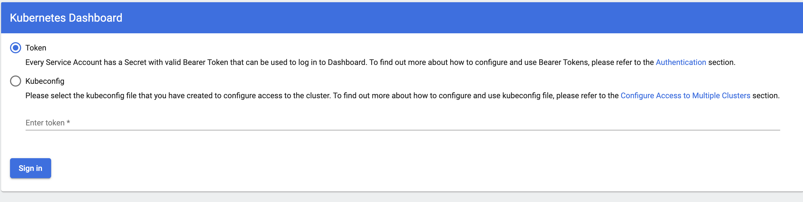

# Kubernetes 安装

## 1 Docker for Mac Desktop集成（学习使用）

### 1.1 Enable Kubernetes

### 1.2 验证

```
➜  tools kubectl get nodes
NAME             STATUS   ROLES                  AGE   VERSION
docker-desktop   Ready    control-plane,master   24s   v1.21.4
➜  tools kubectl cluster-info
Kubernetes control plane is running at https://kubernetes.docker.internal:6443
CoreDNS is running at https://kubernetes.docker.internal:6443/api/v1/namespaces/kube-system/services/kube-dns:dns/proxy

To further debug and diagnose cluster problems, use 'kubectl cluster-info dump'.
➜  tools kubectl describe node
Name:               docker-desktop
Roles:              control-plane,master
Labels:             beta.kubernetes.io/arch=amd64
                    beta.kubernetes.io/os=linux
                    kubernetes.io/arch=amd64
                    kubernetes.io/hostname=docker-desktop
                    kubernetes.io/os=linux
                    node-role.kubernetes.io/control-plane=
                    node-role.kubernetes.io/master=
                    node.kubernetes.io/exclude-from-external-load-balancers=
Annotations:        kubeadm.alpha.kubernetes.io/cri-socket: /var/run/dockershim.sock
                    node.alpha.kubernetes.io/ttl: 0
                    volumes.kubernetes.io/controller-managed-attach-detach: true
.......
```


## 2 二进制安装部署（生产环境适用，新手推荐）

## 3 使用Kubeadmin进行部署（相对简单，熟手推荐）

## 4 部署Kubernetes Dashboard

https://github.com/kubernetes/dashboard

### 4.1 启动Dashboard

```
kubectl apply -f https://raw.githubusercontent.com/kubernetes/dashboard/master/aio/deploy/recommended.yaml
# 开启本机访问代理，默认监听 8001 端口
$ kubectl proxy
```

### 4.2 登录

访问以下地址，

`http://localhost:8001/api/v1/namespaces/kubernetes-dashboard/services/https:kubernetes-dashboard:/proxy/#/login`



### 4.3 创建管理员用户

首先创建文件dashboard-admin.yaml:

```yaml
apiVersion: v1
kind: ServiceAccount
metadata:
  name: kubernetes-dashboard-admin
  namespace: kubernetes-dashboard
  labels:
    k8s-app: kubernetes-dashboard
---
apiVersion: rbac.authorization.k8s.io/v1
kind: ClusterRoleBinding
metadata:
  name: kubernetes-dashboard-admin
  namespace: kubernetes-dashboard
roleRef:
  apiGroup: rbac.authorization.k8s.io
  kind: ClusterRole
  name: cluster-admin
subjects:
- kind: ServiceAccount
  name: kubernetes-dashboard-admin
  namespace: kubernetes-dashboard
```

然后创建管理员用户，生成 Token

```
# 创建 ServiceAccount kubernetes-dashboard-admin 并绑定集群管理员权限
$ kubectl apply -f dashboard-admin.yaml

# 获取登陆 token
$ kubectl -n kubernetes-dashboard describe secret $(kubectl -n kubernetes-dashboard get secret | grep kubernetes-dashboard-admin | awk '{print $1}')
```

Token生成如下：


### 4.4 使用Token登陆

填入上面的Token后即可登录，


