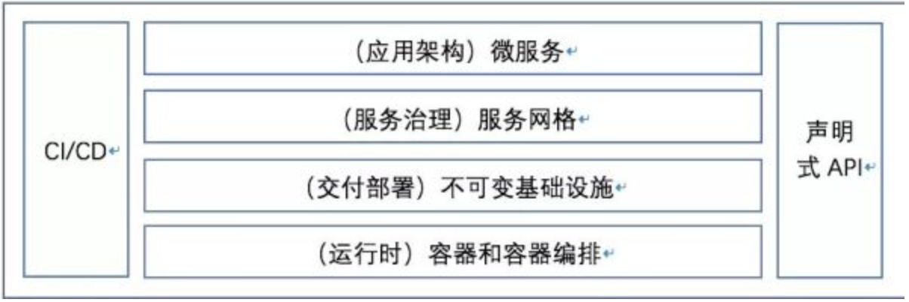

# Kubernetes基础入门

## 1 背景

我们需要一套容器编排的工具，基于Docker容器引擎的开源容器编排工具目前市场上主要有：

- docker compose、docker swarm
- Mesosphere + Marathon
- Kubernetes（K8S）

### 1.1 什么是云原生？

​	以下定义摘自CNCF组织官网，https://www.cncf.io/about/who-we-are/

> Cloud native technologies empower organizations to build and run scalable applications in modern, dynamic environments such as public, private, and hybrid clouds. Containers, service meshes, microservices, immutable infrastructure, and declarative APIs exemplify this approach.
>
> These techniques enable loosely coupled systems that are resilient, manageable, and observable. Combined with robust automation, they allow engineers to make high-impact changes frequently and predictably with minimal toil.
>
> The Cloud Native Computing Foundation seeks to drive adoption of this paradigm by fostering and sustaining an ecosystem of open source, vendor-neutral projects. We democratize state-of-the-art patterns to make these innovations accessible for everyone.

由此可知，CNCF在定义中给出了云原生的关键技术：容器、服务网格、微服务、不可变基础设置、和声明式API等，是目前云原生的最佳实践。下图为云原生的基本技术栈：



### 1.2 云原生程序的特点

- 程序的配置，通过设置**环境变量**传递到容器内部
- 程序的配置，通过程序**启动参数**配置生效
- 程序的配置，通过集中在**配置中心进行统一管理

> 有状态的app一般不往K8S中放

## 2 Kubernetes 概述

官网：https://kubernetes.io/

Github：https://github.com/kubernetes/kubernetes

### 2.1 What's Kubernetes

This page is an overview of Kubernetes.

Kubernetes is a portable, extensible, open-source platform for managing containerized workloads and services, that facilitates both declarative configuration and automation. It has a large, rapidly growing ecosystem. Kubernetes services, support, and tools are widely available.

The name Kubernetes originates from Greek, meaning helmsman or pilot. K8s as an abbreviation results from counting the eight letters between the "K" and the "s". Google open-sourced the Kubernetes project in 2014. Kubernetes combines [over 15 years of Google's experience](https://kubernetes.io/blog/2015/04/borg-predecessor-to-kubernetes/) running production workloads at scale with best-of-breed ideas and practices from the community.

#### 2.1.1 Going back in time


**Traditional deployment era:** Early on, organizations ran applications on physical servers. There was no way to define resource boundaries for applications in a physical server, and this caused resource allocation issues. For example, if multiple applications run on a physical server, there can be instances where one application would take up most of the resources, and as a result, the other applications would underperform. A solution for this would be to run each application on a different physical server. But this did not scale as resources were underutilized, and it was expensive for organizations to maintain many physical servers.

**Virtualized deployment era:** As a solution, virtualization was introduced. It allows you to run multiple Virtual Machines (VMs) on a single physical server's CPU. Virtualization allows applications to be isolated between VMs and provides a level of security as the information of one application cannot be freely accessed by another application.

Virtualization allows better utilization of resources in a physical server and allows better scalability because an application can be added or updated easily, reduces hardware costs, and much more. With virtualization you can present a set of physical resources as a cluster of disposable virtual machines.

Each VM is a full machine running all the components, including its own operating system, on top of the virtualized hardware.

**Container deployment era:** Containers are similar to VMs, but they have relaxed isolation properties to share the Operating System (OS) among the applications. Therefore, containers are considered lightweight. Similar to a VM, a container has its own filesystem, share of CPU, memory, process space, and more. As they are decoupled from the underlying infrastructure, they are portable across clouds and OS distributions.

Containers have become popular because they provide extra benefits, such as:

- Agile application creation and deployment: increased ease and efficiency of container image creation compared to VM image use.
- Continuous development, integration, and deployment: provides for reliable and frequent container image build and deployment with quick and efficient rollbacks (due to image immutability).
- Dev and Ops separation of concerns: create application container images at build/release time rather than deployment time, thereby decoupling applications from infrastructure.
- Observability: not only surfaces OS-level information and metrics, but also application health and other signals.
- Environmental consistency across development, testing, and production: Runs the same on a laptop as it does in the cloud.
- Cloud and OS distribution portability: Runs on Ubuntu, RHEL, CoreOS, on-premises, on major public clouds, and anywhere else.
- Application-centric management: Raises the level of abstraction from running an OS on virtual hardware to running an application on an OS using logical resources.
- Loosely coupled, distributed, elastic, liberated micro-services: applications are broken into smaller, independent pieces and can be deployed and managed dynamically – not a monolithic stack running on one big single-purpose machine.
- Resource isolation: predictable application performance.
- Resource utilization: high efficiency and density.

#### 2.1.2 What kubernetes can do

- **Service discovery and load balancing** Kubernetes can expose a container using the DNS name or using their own IP address. If traffic to a container is high, Kubernetes is able to load balance and distribute the network traffic so that the deployment is stable.
- **Storage orchestration** Kubernetes allows you to automatically mount a storage system of your choice, such as local storages, public cloud providers, and more.
- **Automated rollouts and rollbacks** You can describe the desired state for your deployed containers using Kubernetes, and it can change the actual state to the desired state at a controlled rate. For example, you can automate Kubernetes to create new containers for your deployment, remove existing containers and adopt all their resources to the new container.
- **Automatic bin packing** You provide Kubernetes with a cluster of nodes that it can use to run containerized tasks. You tell Kubernetes how much CPU and memory (RAM) each container needs. Kubernetes can fit containers onto your nodes to make the best use of your resources.
- **Self-healing** Kubernetes restarts containers that fail, replaces containers, kills containers that don't respond to your user-defined health check, and doesn't advertise them to clients until they are ready to serve.
- **Secret and configuration management** Kubernetes lets you store and manage sensitive information, such as passwords, OAuth tokens, and SSH keys. You can deploy and update secrets and application configuration without rebuilding your container images, and without exposing secrets in your stack configuration.

### 2.2 Kubernetes基本概念

#### 2.2.1 Pod/Pod控制器

##### 2.2.1.1 Pod

- Pod是K8S里能够运行的最小的逻辑单元（原子单元）
- 1个pod里可以运行多个容器，他们共享UTS+NET+IPC等namespace
- 可以把Pod理解成豌豆荚，而同一个pod内的每个容器是一个个的豌豆
- 一个Pod里运行多个容器，叫边车模式（Sidecar）

###### 2.2.1.1.1 为什么Pod必须是原子调度单位？

> 1. 进程组概念 Pod = “进程组”
> 2. 有些容器需要紧密合作 需要在同一个宿主机上  (业务容器 日志转发容器)  **亲密关系**-调度解决
>
> **Pod 里面的容器是“超亲密关系”**
>
> **超亲密关系**-pod解决
>
> - 比如说两个进程之间会发生文件交换，一个写日志，一个读日志；
> - 两个进程之间需要通过 localhost 或者说是本地的 Socket 去进行通信，这种本地通信也是超亲密关系；
> - 这两个容器或者是微服务之间，需要发生非常频繁的 RPC 调用，出于性能的考虑，也希望它们是超亲密关系；
> - 两个容器或者是应用，它们需要共享某些 Linux Namespace。最简单常见的一个例子，就是我有一个容器需要加入另一个容器的 Network Namespace。这样我就能看到另一个容器的网络设备，和它的网络信息。

###### 2.2.1.1.2 Pod要解决的问题

- 共享网络

> 启动一个infra container 共享Network Namespace其他容器加入到 Infra container 的 Network Namespace 中。整个 Pod 里面，必然是 Infra container 第一个启动。并且整个 Pod 的生命周期是等同于 Infra container 的生命周期的，与容器A 和 B 是无关的。

- 共享存储

> 两个容器挂载同一个目录  日志收集

##### 2.2.1.2 Pod控制器

Pod控制器是pod启动的一种模版，用来保证在K8S里启动的Pod应始终按照我们的预期运行（副本数、生命周期、健康状态检查）。

K8S内提供众多的Pod控制器，

- Deployment
- DaemonSet（每个节点起一份）
- ReplicaSet（Deployment管 ReplicaSet，ReplicaSet管pod）
- StatefulSet（管理有状态应用的）
- Job
- CronJob

###### 2.2.1.2.1 Deployment

- 字段解析

> **MinReadySeconds**：30    Pod ready 超过 30 秒之后才认为 Pod 是 available 的
>
> **revisionHistoryLimit**： 保留历史 revision，即保留历史 ReplicaSet 的数量，默认值为 10 个paused：paused 是标识，**Deployment** 只做数量维持，不做新的发布，这里在 Debug 场景可能会用到；**progressDeadlineSeconds**：当 Deployment 处于扩容或者发布状态时，它会处于一个 processing 的状态，processing 可以设置一个超时时间。如果超过超时时间还处于 processing，那么 controller 将认为这个 Pod 会进入 failed 的状态。
>
> 升级策略字段
>
> **MaxUnavailable**：滚动过程中最多有多少个 Pod 不可用；默认25% 
>
> **MaxSurge**：滚动过程中最多存在多少个 Pod 超过预期 replicas 数量  默认25% 
>
> 要注意的是 MaxSurge 和 MaxUnavailable 不能同时为 0

- ###### 管理模式

> 1. Deployment只负责管理不同版本的ReplicaSet, 由ReplicaSet管理Pod副本数 每个ReplicaSet对应了Deployment template的一个版本 一个ReplicaSet下的Pod都是相同的版本
> 2. Deployment 管理多版本的方式，是针对每个版本的 template 创建一个 ReplicaSet，由 ReplicaSet 维护一定数量的 Pod 副本，而 Deployment 只需要关心不同版本的 ReplicaSet 里要指定多少数量的 Pod；
> 3. 因此，Deployment 发布部署的根本原理，就是 Deployment 调整不同版本 ReplicaSet 里的终态副本数，以此来达到多版本 Pod 的升级和回滚。

###### 2.2.1.2.2 Cron Job

> schedule：设置时间格式，它的时间格式和 Linux 的 crontime 是一样的
>
> startingDeadlineSeconds：即：每次运行 Job 的时候，它最长可以等多长时间，有时这个 Job 可能运行很长时间也不会启动。所以这时，如果超过较长时间的话，CronJob 就会停止这个 Job；
>
> concurrencyPolicy：就是说是否允许并行运行。第二个 Job 要到时间需要去运行的时候，上一个 Job 还没完成。如果这个 policy 设置为 true 的话，那么不管你前面的 Job 是否运行完成，每分钟都会去执行；如果是 false，它就会等上一个 Job 运行完成之后才会运行下一个；
>
> JobsHistoryLimit：指定任务历史存留数

1. Job Controller负责根据配置创建Pod
2. Job Controller跟踪Job状态,根据配置及时重试Pod或者继续创建
3. Job Controller会自动添加label来跟踪对应的pod,并根据配置并行或者串行创建Pod

###### 2.2.1.2.3 Daement Set

- ## 更新策略

>  **RollingUpdate** 其实比较好理解，就是会一个一个的更新。先更新第一个 pod，然后老的 pod 被移除，通过健康检查之后再去见第二个 pod，这样对于业务上来说会比较平滑地升级，不会中断；
>
> **OnDelete** 模板更新之后，pod 不会有任何变化，需要我们手动控制。删除某一个节点对应的 pod，它就会重建，不删除的话它就不会重建

- ## 管理模式

> 1. DaemonSet Controller负责根据配置创建Pod
> 2. DaemonSet Controller跟踪Job状态，根据配置及时重试Pod或者继续创建
> 3. DaemonSet Controller会自动添加affinity&label来跟踪对应的pod,并根据配置在每个节点或者适合的部分节点创建Pod

##### 2.2.1.3 容器设计模式

- ### InitContainer

> 首先启动 退出后 启动别的容器 tomcat+war包 (war包cp到emptydir第二个容器挂emptydir) 

- ### Sidecar

> sidecar 通过在Pod里定义专门容器，来执行主业务容器需要的辅助工作
>
> - 原本需要在容器里面执行 SSH 需要干的一些事情，可以写脚本、一些前置的条件，其实都可以通过像 Init Container 或者另外像 Sidecar 的方式去解决；
> - 当然还有一个典型例子就是我的日志收集，日志收集本身是一个进程，是一个小容器，那么就可以把它打包进 Pod 里面去做这个收集工作；
> - 还有一个非常重要的东西就是 Debug 应用，实际上现在 Debug 整个应用都可以在应用 Pod 里面再次定义一个额外的小的 Container，它可以去 exec 应用 pod 的 namespace；
> - 查看其他容器的工作状态，这也是它可以做的事情。不再需要去 SSH 登陆到容器里去看，只要把监控组件装到额外的小容器里面就可以了，然后把它作为一个 Sidecar 启动起来，跟主业务容器进行协作，所以同样业务监控也都可以通过 Sidecar 方式来去做。
>
> - **优势:** 
>
>   辅助功能从业务容器解耦，所以我就能够独立发布 Sidecar 容器，
>
>   更重要的是这个能力是可以重用的，即同样的一个监控 Sidecar 或者日志 Sidecar，可以被全公司的人共用

#### 2.2.2 Name/Namespace

##### 2.2.2.1 Name

- 由于K8S内部，使用“资源”定义每种逻辑概念，故每种“资源”都有自己的“名称”
- "资源”有api版本( apiVersion )类别( kind )、元数据( metadata)、定义清单( spec)、状态( status )等配置信息
- “名称”通常定义在“资源”的“元数据”信息里

##### 2.2.2.2 Namespace

- 随着项目增多、人员增加、集群规模的扩大,需要- -种能够隔离K8S内各种"资源”的方法，这就是名称空间
- 名称空间可以理解为K8S内部的虚拟集群组
- 不同名称空间内的"资源”名称可以相同,相同名称空间内的同种“资源”，”名称” 不能相同
- 合理的使用K8S的名称空间,使得集群管理员能够更好的对交付到K8S里的服务进行分类管理和浏览
- K8S里默认存在的名称空间有: default、 kube-system、 kube-public
- 查询K8S里特定“资源”要带上相应的名称空间

#### 2.2.3 Label/Label选择器

##### 2.2.3.1 Label

- 标签是k8s特色的管理方式,便于分类管理资源对象。
- 一个标签可以对应多个资源，-个资源也可以有多个标签,它们是多对多的关系。
- 一个资源拥有多个标签,可以实现不同维度的管理。
- 标签的组成: key=value(值不能多余64个字节字母数字开头 中间只能是 - _ .）
- 与标签类似的,还有一种“注解” ( annotations )

##### 2.2.3.2 Label选择器

- 给资源打上标签后,可以使用标签选择器过滤指定的标签
- 标签选择器目前有两个:基于等值关系(等于、不等于)和基于集合关系(属于、不属于、存在)
- 许多资源支持内嵌标签选择器字段
  - match_labels
  - match Expressions

#### 2.2.4 Service/Ingress

##### 2.2.4.1 Service

- 在K8S的世界里,虽然每个Pod都会被分配一个单独的IP地址,但这个IP地址会随着Pod的销毁而消失
- Service (服务)就是用来解决这个问题的核心概念
- 一个Service可以看作- -组提供相同服务的Pod的对外访问接口
- Service作用于哪些Pod是通过标签选择器来定义的

##### 2.2.4.2 Ingress

- Ingress是K8S集群里工作在OSI网络参考模型下,第7层的应用,对外暴露的接口
- Service只能进行L4流量调度,表现形式是ip+port
- Ingress则可以调度不同业务域、 不同URL访问路径的业务流量

## 3 Kubernetes 组件

> A Kubernetes cluster consists of a set of worker machines, called [nodes](https://kubernetes.io/docs/concepts/architecture/nodes/), that run containerized applications. Every cluster has at least one worker node.
>
> The worker node(s) host the [Pods](https://kubernetes.io/docs/concepts/workloads/pods/) that are the components of the application workload. The [control plane](https://kubernetes.io/docs/reference/glossary/?all=true#term-control-plane) manages the worker nodes and the Pods in the cluster. In production environments, the control plane usually runs across multiple computers and a cluster usually runs multiple nodes, providing fault-tolerance and high availability.
>
> Here's the diagram of a Kubernetes cluster with all the components tied together.


### 3.1 Control Plane Components(主控节点/master)

> The control plane's components make global decisions about the cluster (for example, scheduling), as well as detecting and responding to cluster events (for example, starting up a new [pod](https://kubernetes.io/docs/concepts/workloads/pods/) when a deployment's `replicas` field is unsatisfied).
>
> Control plane components can be run on any machine in the cluster. However, for simplicity, set up scripts typically start all control plane components on the same machine, and do not run user containers on this machine.

主控节点主要包括以下几个组件：

- etcd：配置存储中心，一般配置为高可用模式，奇数个节点即可。
- kube-api-server
- kube-controller-manager
- kube-scheduler

#### 3.1.1 kube-apiserver

> The API server is a component of the Kubernetes [control plane](https://kubernetes.io/docs/reference/glossary/?all=true#term-control-plane) that exposes the Kubernetes API. The API server is the front end for the Kubernetes control plane.
>
> The main implementation of a Kubernetes API server is [kube-apiserver](https://kubernetes.io/docs/reference/generated/kube-apiserver/). kube-apiserver is designed to scale horizontally—that is, it scales by deploying more instances. You can run several instances of kube-apiserver and balance traffic between those instances.

Kube-apiserver 主要提供了以下功能：

- 提供了集群管理的RESTAPI接口(包括鉴权、数据校验及集群状态变更)
- 负责其他模块之间的数据交互,承担通信枢纽功能
- 是资源配额控制的入口
- 提供完备的集群安全机制

#### 3.1.2 etcd

> Consistent and highly-available key value store used as Kubernetes' backing store for all cluster data.
>
> If your Kubernetes cluster uses etcd as its backing store, make sure you have a [back up](https://kubernetes.io/docs/tasks/administer-cluster/configure-upgrade-etcd/#backing-up-an-etcd-cluster) plan for those data.

#### 3.1.3 kube-scheduler

> Control plane component that watches for newly created [Pods](https://kubernetes.io/docs/concepts/workloads/pods/) with no assigned [node](https://kubernetes.io/docs/concepts/architecture/nodes/), and selects a node for them to run on.
>
> Factors taken into account for scheduling decisions include: individual and collective resource requirements, hardware/software/policy constraints, affinity and anti-affinity specifications, data locality, inter-workload interference, and deadlines.

Kube-scheduler 主要提供以下功能：

- 主要功能是接收调度pod到适合的运算节点上
- 预选策略( predict )
- 优选策略( priorities )

#### 3.1.4 kube-contronller-manager

> Control plane component that runs [controller](https://kubernetes.io/docs/concepts/architecture/controller/) processes.
>
> Logically, each [controller](https://kubernetes.io/docs/concepts/architecture/controller/) is a separate process, but to reduce complexity, they are all compiled into a single binary and run in a single process.
>
> Some types of these controllers are:
>
> - Node controller: Responsible for noticing and responding when nodes go down.
> - Job controller: Watches for Job objects that represent one-off tasks, then creates Pods to run those tasks to completion.
> - Endpoints controller: Populates the Endpoints object (that is, joins Services & Pods).
> - Service Account & Token controllers: Create default accounts and API access tokens for new namespaces.

Kube controller manager 由一系列控制器组成，通过apiserver监控整个集群的状态，并确保集群处于预期的工作状态。

- Node Controller
- Deployment Controller
- Service Controller
- Volume Controller
- Endpoint Controller
- Garbage Controller
- Namespace Controller
- Job Controller
- Resource quta Controller

### 3.2 Node Components(运算节点/node)

> Node components run on every node, maintaining running pods and providing the Kubernetes runtime environment.

#### 3.2.1 kubelet 

> An agent that runs on each [node](https://kubernetes.io/docs/concepts/architecture/nodes/) in the cluster. It makes sure that [containers](https://kubernetes.io/docs/concepts/containers/) are running in a [Pod](https://kubernetes.io/docs/concepts/workloads/pods/).
>
> The kubelet takes a set of PodSpecs that are provided through various mechanisms and ensures that the containers described in those PodSpecs are running and healthy. The kubelet doesn't manage containers which were not created by Kubernetes.

- 简单地说, kubelet的主要功能就是定时从某个地方获取节点上pod的期望状态(运行什么容器、运行的副本数量、网络或者存储如何配置等等) ,并调用对应的容器平台接口达到这个状态
- 定时汇报当前节点的状态给apiserver,以供调度的时候使用
- 镜像和容器的清理工作，保证节点上镜像不会占满磁盘空间，退出的容器不会占用太多资源

#### 3.2.2 kube-proxy

> kube-proxy is a network proxy that runs on each [node](https://kubernetes.io/docs/concepts/architecture/nodes/) in your cluster, implementing part of the Kubernetes [Service](https://kubernetes.io/docs/concepts/services-networking/service/) concept.
>
> [kube-proxy](https://kubernetes.io/docs/reference/command-line-tools-reference/kube-proxy/) maintains network rules on nodes. These network rules allow network communication to your Pods from network sessions inside or outside of your cluster.
>
> kube-proxy uses the operating system packet filtering layer if there is one and it's available. Otherwise, kube-proxy forwards the traffic itself.

- 是K8S在每个节点上运行网络代理, service资源的载体
- **建立了pod网络和集群网络的关系**( clusterip >podip )
- 常用三种流量调度模式
  - Userspace (废弃)
  - Iptables (濒临废弃)（绝大部分公司在用）
  - Ipvs(推荐)

- 负责建立和删除包括更新调度规则、通知apiserver自己的更新,或者从apiserver那里获取其他kube- proxy的调度规则变化来更新自己的

### 3.3 Kubernetes 客户端

- ### kubectl

  Kubernetes 命令行工具，`kubectl`，使得你可以对 Kubernetes 集群运行命令。 你可以使用 `kubectl` 来部署应用、监测和管理集群资源以及查看日志。

### 3.4 Kubernetes 核心插件

#### 3.4.1 CNI网络插件（Flannel/Calico）

k8s设计了网络模型，但却将他的实现交给了网络插件，CNI网络插件最主要的功能就是实现Pod资源能够跨主机进行通信。种类众多，以Flannel为例：

- 三种常用工作模式
- 优化SNAT规则

#### 3.4.2 服务发现用插件（CoreDNS）

服务发现就是服务（应用）之间相互定位的过程：

- 集群网络：Cluster IP
- Service资源：Service Name .
- CoreDNS软件：实现了Service Name和Cluster IP的自动关联

#### 3.4.3 服务暴露用插件（Traefik）

服务暴露就是使k8s的服务能够被外部使用和访问，Ingress资源就是专用于暴露7层应用到K8S集群外的一种核心资源(http/https)。

- Ingress控制器：一个简化版的nginx (调度流量) + go脚本(动态识别yaml)

- Traefik软件：实现了ingress控制器的一个软件

#### 3.4.4 GUI管理插件（Dashboard）

> [Dashboard](https://kubernetes.io/docs/tasks/access-application-cluster/web-ui-dashboard/) is a general purpose, web-based UI for Kubernetes clusters. It allows users to manage and troubleshoot applications running in the cluster, as well as the cluster itself.

## 4 Kubernetes 核心资源的管理方法

- 陈述式管理方法 - 主要依赖命令行CLI工具进行管理
- 声明式管理方法 - 主要依赖统一资源配置清单（manifest）进行管理
- GUI式管理方法 - 主要依赖图形化操作界面进行管理

### 4.1 陈述式资源管理

- Kubernetes管理集群资源的唯一入口就是通过相应的方法调用apiserver的接口
- kubectl是官方的CLI命令行工具，用于与apiserver进行通信，将用户在命令行输入的命令，组织并转化为apiserver能识别的信息，进而实现管理K8S各种资源的一种有效途径
- 陈述式资源管理方法可以满足90%以上的资源管理需求，但它的缺点也很明显
  - 命令冗长、复杂、难以记忆
  - 特定场景下，无法实现管理需求
  - 对资源的增、删、查操作比较容易，改就很痛苦

#### 4.1.1 管理名称空间

##### 4.1.1.1 查看名称空间

```
➜  kubernetes kubectl get namespace
NAME                   STATUS   AGE
default                Active   15h
kube-node-lease        Active   15h
kube-public            Active   15h
kube-system            Active   15h
kubernetes-dashboard   Active   15h
```

> 查询资源的时候应该要带上namespace

##### 4.1.1.2 查看default命名空间的所有资源

```
➜  kubernetes kubectl get all -n default
NAME                 TYPE        CLUSTER-IP   EXTERNAL-IP   PORT(S)   AGE
service/kubernetes   ClusterIP   10.96.0.1    <none>        443/TCP   15h
```

> default 默认可以省略，其他的不行

##### 4.1.1.3 创建名称空间

```
➜  ~ kubectl create ns app
namespace/app created
➜  ~ kubectl get ns
NAME                   STATUS   AGE
app                    Active   8s
default                Active   15h
kube-node-lease        Active   15h
kube-public            Active   15h
kube-system            Active   15h
kubernetes-dashboard   Active   15h
```

##### 4.1.1.4 删除名称空间

```
➜  ~ kubectl delete ns app
namespace "app" deleted
```

#### 4.1.2 管理deployment资源

##### 4.1.2.1 创建deployment资源

```
➜  ~ kubectl create deployment nginx-dp --image=nginx:latest -n app-dev
deployment.apps/nginx-dp created
```

创建后可以用docker命令查看到相应的container

```
➜  ~ docker ps
CONTAINER ID   IMAGE                                COMMAND                  CREATED         STATUS         PORTS     NAMES
bc1cfcb95778   nginx                                "/docker-entrypoint.…"   2 minutes ago   Up 2 minutes             k8s_nginx_nginx-dp-5849f68b88-pphjb_app-dev_80144e55-d3ae-4ced-b637-0366a41a7800_0
9632f5dca378   k8s.gcr.io/pause:3.4.1               "/pause"                 3 minutes ago   Up 3 minutes             k8s_POD_nginx-dp-5849f68b88-pphjb_app-dev_80144e55-d3ae-4ced-b637-0366a41a7800_0
```

##### 4.1.2.2 查看deployment资源

```
➜  ~ kubectl get deploy -n app-dev
NAME       READY   UP-TO-DATE   AVAILABLE   AGE
nginx-dp   1/1     1            1           21s
```

##### 4.1.2.3 查看deployment资源（详细）

```
➜  ~ kubectl describe deployment nginx-dp -n app-dev
Name:                   nginx-dp
Namespace:              app-dev
CreationTimestamp:      Sun, 03 Oct 2021 13:39:38 +0800
Labels:                 app=nginx-dp
Annotations:            deployment.kubernetes.io/revision: 1
Selector:               app=nginx-dp
Replicas:               1 desired | 1 updated | 1 total | 1 available | 0 unavailable
StrategyType:           RollingUpdate
MinReadySeconds:        0
RollingUpdateStrategy:  25% max unavailable, 25% max surge
Pod Template:
  Labels:  app=nginx-dp
  Containers:
   nginx:
    Image:        nginx:latest
    Port:         <none>
    Host Port:    <none>
    Environment:  <none>
    Mounts:       <none>
  Volumes:        <none>
Conditions:
  Type           Status  Reason
  ----           ------  ------
  Available      True    MinimumReplicasAvailable
  Progressing    True    NewReplicaSetAvailable
OldReplicaSets:  <none>
NewReplicaSet:   nginx-dp-5849f68b88 (1/1 replicas created)
Events:
  Type    Reason             Age    From                   Message
  ----    ------             ----   ----                   -------
  Normal  ScalingReplicaSet  6m16s  deployment-controller  Scaled up replica set nginx-dp-5849f68b88 to 1
```

##### 4.1.2.4 查看pod资源

```
➜  ~ kubectl get pods -n app-dev
NAME                        READY   STATUS    RESTARTS   AGE
nginx-dp-5849f68b88-pphjb   1/1     Running   0          39s
➜  ~ kubectl get pods -n app-dev -o wide
NAME                        READY   STATUS    RESTARTS   AGE   IP         NODE             NOMINATED NODE   READINESS GATES
nginx-dp-5849f68b88-pphjb   1/1     Running   0          45s   10.1.0.8   docker-desktop   <none>           <none>
```

##### 4.1.2.5 进入pod资源

```
➜  ~ kubectl exec nginx-dp-5849f68b88-pphjb -it /bin/bash -n app-dev
kubectl exec [POD] [COMMAND] is DEPRECATED and will be removed in a future version. Use kubectl exec [POD] -- [COMMAND] instead.
root@nginx-dp-5849f68b88-pphjb:/# exit
```

新版本的写法如下：

```
➜  ~ kubectl exec nginx-dp-5849f68b88-pphjb -n app-dev -it -- /bin/bash
root@nginx-dp-5849f68b88-pphjb:/# hostname
nginx-dp-5849f68b88-pphjb
root@nginx-dp-5849f68b88-pphjb:/#
```

当然也可以通过docker exec进入pod

##### 4.1.2.6 删除pod资源（重启）

可以先watch观察一下pod的状态如下：`watch -n 1 'kubectl describe deployment nginx-dp -n app-dev|grep -C 5 Event'`

```
Every 1.0s: kubectl describe deployment nginx-dp -n app-dev|grep -C 5 Event                                                                                                      C02DTFJJMD6N: Sun Oct  3 15:32:49 2021

  ----           ------  ------
  Progressing    True    NewReplicaSetAvailable
  Available      True    MinimumReplicasAvailable
OldReplicaSets:  <none>
NewReplicaSet:   nginx-dp-5849f68b88 (1/1 replicas created)
Events:
  Type    Reason             Age   From                   Message
  ----    ------             ----  ----                   -------
  Normal  ScalingReplicaSet  113m  deployment-controller  Scaled up replica set nginx-dp-5849f68b88 to 1
```

然后可以删除，后面可以发现已经重新启动一个新的pod

```
➜  ~ kubectl delete pod nginx-dp-5849f68b88-pphjb -n app-dev
pod "nginx-dp-5849f68b88-pphjb" deleted
➜  ~ kubectl get pods -n app-dev
NAME                        READY   STATUS    RESTARTS   AGE
nginx-dp-5849f68b88-c25xt   1/1     Running   0          24s
```

##### 4.1.2.7 删除deployment

```
➜  ~ kubectl delete deploy nginx-dp -n app-dev
deployment.apps "nginx-dp" deleted
➜  ~ kubectl get pods -n app-dev -o wide
NAME                        READY   STATUS        RESTARTS   AGE   IP         NODE             NOMINATED NODE   READINESS GATES
nginx-dp-5849f68b88-c25xt   0/1     Terminating   0          16m   10.1.0.9   docker-desktop   <none>           <none>
➜  ~ kubectl get pods -n app-dev -o wide
No resources found in app-dev namespace.
```

#### 4.1.3 管理Service资源

##### 4.1.3.1 创建service

之前把deployment删除了，先创建起来

```
➜  ~ kubectl create deployment nginx-dp --image=nginx:latest -n app-dev
deployment.apps/nginx-dp created
➜  ~ kubectl get pods -n app-dev -o wide
NAME                        READY   STATUS              RESTARTS   AGE   IP       NODE             NOMINATED NODE   READINESS GATES
nginx-dp-5849f68b88-g9grh   0/1     ContainerCreating   0          4s    <none>   docker-desktop   <none>           <none>
➜  ~ kubectl get pods -n app-dev -o wide
NAME                        READY   STATUS    RESTARTS   AGE   IP          NODE             NOMINATED NODE   READINESS GATES
nginx-dp-5849f68b88-g9grh   1/1     Running   0          8s    10.1.0.10   docker-desktop   <none>           <none>
➜  ~
```

创建service需要expose命令，默认暴露的service type是ClusterIP，这样是在Mac宿主机无法访问到pod中nginx服务。

```
➜  ~ kubectl expose deployment nginx-dp --port=80 -n app-dev
service/nginx-dp exposed
➜  ~ kubectl get all -n app-dev
NAME                            READY   STATUS    RESTARTS   AGE
pod/nginx-dp-5849f68b88-g9grh   1/1     Running   0          2m34s

NAME               TYPE        CLUSTER-IP     EXTERNAL-IP   PORT(S)   AGE
service/nginx-dp   ClusterIP   10.109.2.103   <none>        80/TCP    23s

NAME                       READY   UP-TO-DATE   AVAILABLE   AGE
deployment.apps/nginx-dp   1/1     1            1           2m34s

NAME                                  DESIRED   CURRENT   READY   AGE
replicaset.apps/nginx-dp-5849f68b88   1         1         1       2m34s
```

如果需要本地Mac宿主机能够访问到k8s pod中的nginx服务，则需要暴露为type=nodeport,结果如下。

`kubectl expose deployment nginx-dp --port=80 --type=NodePort -n app-dev`

```
➜  ~ kubectl expose deployment nginx-dp --port=80 --type=NodePort -n app-dev
service/nginx-dp exposed
➜  ~ kubectl get svc nginx-dp -n app-dev
NAME       TYPE       CLUSTER-IP    EXTERNAL-IP   PORT(S)        AGE
nginx-dp   NodePort   10.111.0.11   <none>        80:31807/TCP   5s
➜  ~ kubectl get svc nginx-dp -n app-dev -o yaml
apiVersion: v1
kind: Service
metadata:
  creationTimestamp: "2021-10-03T08:33:18Z"
  labels:
    app: nginx-dp
  name: nginx-dp
  namespace: app-dev
  resourceVersion: "37558"
  uid: c4f1a961-7750-48aa-bfc2-e8f133798d87
spec:
  clusterIP: 10.111.0.11
  clusterIPs:
  - 10.111.0.11
  externalTrafficPolicy: Cluster
  ipFamilies:
  - IPv4
  ipFamilyPolicy: SingleStack
  ports:
  - nodePort: 31807
    port: 80
    protocol: TCP
    targetPort: 80
  selector:
    app: nginx-dp
  sessionAffinity: None
  type: NodePort
status:
  loadBalancer:
    ingress:
    - hostname: localhost
➜  ~
```

由上可知，访问`curl localhost:31807`，可以得到如下结果。

```
➜  ~ curl localhost:31807
<!DOCTYPE html>
<html>
<head>
<title>Welcome to nginx!</title>
<style>
html { color-scheme: light dark; }
body { width: 35em; margin: 0 auto;
font-family: Tahoma, Verdana, Arial, sans-serif; }
</style>
</head>
<body>
<h1>Welcome to nginx!</h1>
<p>If you see this page, the nginx web server is successfully installed and
working. Further configuration is required.</p>

<p>For online documentation and support please refer to
<a href="http://nginx.org/">nginx.org</a>.<br/>
Commercial support is available at
<a href="http://nginx.com/">nginx.com</a>.</p>

<p><em>Thank you for using nginx.</em></p>
</body>
</html>
```


扩展deployment

```
➜  ~ kubectl scale deployment nginx-dp --replicas=2 -n app-dev
deployment.apps/nginx-dp scaled
➜  ~
```

扩展一个pod后，可以看到以下的信息，

```
➜  ~ kubectl get all -n app-dev
NAME                            READY   STATUS    RESTARTS   AGE
pod/nginx-dp-5849f68b88-g9grh   1/1     Running   0          80m
pod/nginx-dp-5849f68b88-tk4ll   1/1     Running   0          73m

NAME               TYPE       CLUSTER-IP    EXTERNAL-IP   PORT(S)        AGE
service/nginx-dp   NodePort   10.111.0.11   <none>        80:31807/TCP   38m

NAME                       READY   UP-TO-DATE   AVAILABLE   AGE
deployment.apps/nginx-dp   2/2     2            2           80m

NAME                                  DESIRED   CURRENT   READY   AGE
replicaset.apps/nginx-dp-5849f68b88   2         2         2       80m
```


##### 4.1.3.2 查看service

再查看一下svc的详细信息

```
➜  ~ kubectl describe svc nginx-dp -n app-dev
Name:                     nginx-dp
Namespace:                app-dev
Labels:                   app=nginx-dp
Annotations:              <none>
Selector:                 app=nginx-dp
Type:                     NodePort
IP Family Policy:         SingleStack
IP Families:              IPv4
IP:                       10.111.0.11
IPs:                      10.111.0.11
LoadBalancer Ingress:     localhost
Port:                     <unset>  80/TCP
TargetPort:               80/TCP
NodePort:                 <unset>  31807/TCP
Endpoints:                10.1.0.10:80,10.1.0.11:80
Session Affinity:         None
External Traffic Policy:  Cluster
Events:                   <none>
```

##### 4.1.3.3 删除service

```
➜  ~ kubectl delete svc nginx-dp -n app-dev
service "nginx-dp" deleted
➜  ~ kubectl get svc nginx-dp -n app-dev
Error from server (NotFound): services "nginx-dp" not found
```

### 4.2 声明式资源管理

- 声明式资源管理的方法依赖于资源配置清单（yaml/json）
- 对资源的管理是通过事先定义在统一资源配置清单内，再通过陈述式应用到k8s集群里
- 语法格式：kubectl create/apply/delete -f /path/to/yaml
- 资源配置清单的学习方法：
  - 多个看官方写的，能读懂
  - 能照着现成的文件改着用
  - 遇到不懂的，善用kubectl explain ...
  - 初学切忌上来就无中生有，自己憋着写

#### 4.2.1 查看资源配置清单

`➜  ~ kubectl get pod nginx-dp-5849f68b88-g9grh -n app-dev -o yaml`

`➜  ~ kubectl get svc nginx-dp -n app-dev -o yaml`

```yaml
apiVersion: v1
kind: Service
metadata:
  creationTimestamp: "2021-10-03T08:33:18Z"
  labels:
    app: nginx-dp
  name: nginx-dp
  namespace: app-dev
  resourceVersion: "37558"
  uid: c4f1a961-7750-48aa-bfc2-e8f133798d87
spec:
  clusterIP: 10.111.0.11
  clusterIPs:
  - 10.111.0.11
  externalTrafficPolicy: Cluster
  ipFamilies:
  - IPv4
  ipFamilyPolicy: SingleStack
  ports:
  - nodePort: 31807
    port: 80
    protocol: TCP
    targetPort: 80
  selector:
    app: nginx-dp
  sessionAffinity: None
  type: NodePort
status:
  loadBalancer:
    ingress:
    - hostname: localhost
```

#### 4.2.2 解释资源配置清单

`➜  ~ kubectl explain service.metadata`

可以解释资源配置清单中的某个属性

#### 4.2.3 创建资源配置清单

首先创建一个文件svc-nginx-ds.yaml如下：

```yaml
apiVersion: v1
kind: Service
metadata:
  labels:
    app: nginx-ds
  name: nginx-ds
  namespace: app-dev
spec:
  ports:
  - nodePort: 31907
    port: 80
    protocol: TCP
    targetPort: 80
  selector:
    app: nginx-dp
  sessionAffinity: None
  type: NodePort
```

然后即可执行以下命令创建一个新的service，

```
➜  ~ kubectl create -f /Users/landyl/Containerization/kubernetes/svc-nginx-ds.yaml
service/nginx-ds created
➜  ~ kubectl get svc -n app-dev
NAME       TYPE       CLUSTER-IP      EXTERNAL-IP   PORT(S)        AGE
nginx-dp   NodePort   10.111.0.11     <none>        80:31807/TCP   72m
nginx-ds   NodePort   10.99.230.128   <none>        80:31907/TCP   57s
➜  ~
```

#### 4.2.4 应用资源配置清单

修改资源配置清单的时候可以使用`kubectl apply -f /Users/landyl/Containerization/kubernetes/svc-nginx-ds.yaml`命令。

#### 4.2.5 修改资源配置清单

##### 4.2.5.1 在线修改

`kubectl edit svc nginx-ds -n app-dev`, 假设修改端口后，如下结果，

```
➜  ~ kubectl edit svc nginx-ds -n app-dev
service/nginx-ds edited
➜  ~ kubectl get svc -n app-dev
NAME       TYPE       CLUSTER-IP      EXTERNAL-IP   PORT(S)        AGE
nginx-dp   NodePort   10.111.0.11     <none>        80:31807/TCP   80m
nginx-ds   NodePort   10.99.230.128   <none>        80:31908/TCP   8m51s
```

##### 4.2.5.2 离线修改（推荐）

修改yaml文件，本例修改了端口号，然后重新apply即可

```
➜  ~ kubectl apply -f /Users/landyl/Containerization/kubernetes/svc-nginx-ds.yaml
Warning: resource services/nginx-ds is missing the kubectl.kubernetes.io/last-applied-configuration annotation which is required by kubectl apply. kubectl apply should only be used on resources created declaratively by either kubectl create --save-config or kubectl apply. The missing annotation will be patched automatically.
service/nginx-ds configured
➜  ~ kubectl get svc -n app-dev
NAME       TYPE       CLUSTER-IP      EXTERNAL-IP   PORT(S)        AGE
nginx-dp   NodePort   10.111.0.11     <none>        80:31807/TCP   95m
nginx-ds   NodePort   10.99.230.128   <none>        80:31909/TCP   23m
➜  ~
```

修改应用后，也是可以看到nginx首页内容如下


#### 4.2.6 删除资源配置清单

- 陈述式删除：`kubectl delete svc nginx-ds` (推荐)
- 声明式删除：`kubectl delete -f svc-nginx-ds.yaml`

## 5 Kubernetes 核心插件

### 5.1 CNI网络插件（Flannel）

CNI网络插件最主要的功能就是实现Pod资源能够跨宿主机进行通信

常见CNI网络插件：

- Flannel（市场占有率38%）
- Calino（市场占有率35%）
- Canal（市场占有率5%）
- Contiv(Cisco 开源)
- OpenContrail
- NSX-T
- Kube-router

### 5.2 服务发现插件（CoreDNS）

- 简单来说，服务发现就是服务（应用）之间相互定位的过程。
- 服务发现并不是云计算时代特有产物，传统的单体结构也会用到。
  - 服务（应用）的动态性强
  - 服务（应用）更新发布频繁
  - 服务（应用）支持自动伸缩
- 在K8S集群里，Pod的IP是不断变化的，如何“以不变应万变”？
  - 抽象出service资源，通过标签选择器，关联一组Pod
  - 抽象出集群网络，通过相对固定的集群IP（ClusterIP），使服务接入固定
- 那么如何自动关联service name和cluster ip呢？从而服务被集群自动发现的目的呢？
  - 考虑传统DNS模型：xxxx.host.come --> 10.20.2.1
  - 能够在K8S集群中建立这样的模型：nginx-ds（service name） --> 192.168.0.2（Cluster IP）
  - K8S服务发现的方式就是参照DNS
- K8S集群DNS功能插件：
  - Kube DNS：Kubernetes v1.2 - Kubernetes v1.10
  - Core DNS：Kubernetes v1.11 至今

> K8S DNS功能不是万能的，它只是自动维护service name和Cluster IP的关系

### 5.3 服务暴露插件（Traefik）

K8S的DNS实现了服务在集群“内”被自动发现，那如何使得服务在集群“外”被使用和访问呢？

- 使用NodePort类型的service
  - 注意：只能使用kube-proxy的iptables模型，无法使用kube-proxy的ipvs模型，因此不推荐用此种方法了。
- 使用Ingress资源
  - 注意：Ingress资源只能调度并暴露7层应用，这里特指http/https协议

#### 5.3.1 NodePort型Service

暴露为type=nodeport，

`kubectl expose deployment nginx-dp --port=80 --type=NodePort -n app-dev`

#### 5.3.2 Ingress资源

- Ingress是K8S API的标准资源之一，也是核心资源，它其实就是一组基于域名和URL路径，把用户的请求转发至指定的service资源的规则
- 可以将集群外部的请求流量，转发至集群内部，从而实现服务暴露
- Ingress控制器可以为Ingress资源监听某套接字，然后根据Ingress规则匹配机制路由调度流量的一个组件
- Ingress其实就是简化版的nginx（流量调度）+一段go脚本（动态识别yaml）而已
- 常见的Ingress控制器实现软件：
  - Ingress-nginx
  - HAProxy
  - Traefik（核心）

### 5.4 GUI管理插件（Dashboard）

## 6 Kubernetes的RBAC原理

RBAC：Role Based Access Control

K8S自1.6版本起，使用基于角色的访问控制（RBAC）

相比于ABAC（基于属性的访问控制）和WebHook等鉴权机制：

- 对集群中的资源的权限实现了完整覆盖
- 支持权限的动态调整，无需重启apiserver

> 权限：
>
> - 读：get
> - 写：write
> - 更新：update
> - 列出：list
> - 监控：watch
>
> 账户：
>
> - 用户账户
> - 服务账户
>
> 角色：
>
> - Role
> - ClusterRole
>
> 绑定角色：
>
> - RoleBinding
> - ClusterRoleBinding

## 7 Kubernetes配置中心

- XDiamond：全局配置中心，存储应用的配置项，解决配置混乱分散的问题。来源于淘宝的开源项目Diamond
- Qconf：Qconf是一个分布式配置管理工具，用来替代传统的配置文件，使得配置信息和程序代码分离，同时配置变化能够实时同步到客户端，而且保证用户高效读取到配置数据，极大的简化了配置管理工作。
- Disconf：专注于各种【分布式系统配置管理】的【通用组件】和【通用平台】，提供统一的配置管理服务。
- SpringCloudConfig：为分布式的外部配置管理提供服务器和客户端支持
- K8S ConfigMap：K8S的一种标准资源，专门用于集中管理应用的配置
- Applo：携程框架部门开源的分布式配置中心
